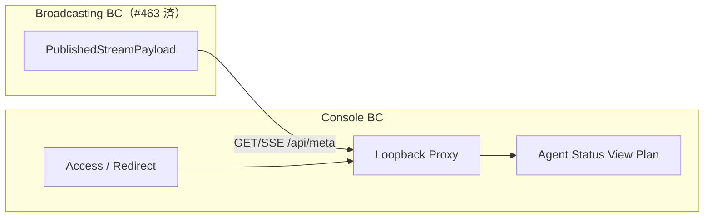

# 管理コンソール境界: ドメインモデルと変更容易性

| 項目 | 内容 |
|------|------|
| **Status** | Implemented (initial slice) |
| **Branch** | `legacy` 上の継続リファクタ |
| **Constraint** | 観測可能な振る舞いを変えない |

> `docs/` は静的サイト資産専用。本ドキュメントは `architecture/` に置く。

## 背景

配信エージェント本体（`MakaMujo` / Publication）は #463 でドメイン分割済み。  
**管理コンソール**は当時の対象外だったが、次の複雑さが残る。

- 外側 TLS + IP 許可リスト + ループバックプロキシ（`console/index.ts`）
- 配信公開ペイロードの **表示計画**（`createAgentStatusRows` / `agentStatusUtils`）
- 放送 API への SSE/HTTP プロキシ（`lib/console-proxy.ts`）

## 境界づけられたコンテキスト



| BC | 責務 | 配置 |
|----|------|------|
| Console Access | 拒否時リダイレクト、IP 制限フラグ、hop-by-hop ヘッダ除去 | `lib/domain/console/access.ts` |
| Agent Status Presentation | 行の有無・表示文言（純関数） | `lib/domain/console/agentStatusPlan.ts` |
| Console UI | JSX / レイアウト | `console/src/AgentStatus/*` |
| Console Host | TLS・プロキシ・WebSocket ブリッジ | `console/index.ts` |

## ユビキタス言語（Console）

| 用語 | 意味 |
|------|------|
| 外側サーバ | :443 TLS、AllowedIP 検査後にループバックへ転送 |
| ループバックコンソール | 127.0.0.1 の Hono ルート本体 |
| 配信指標行 | niconama meta + commentCount の表示ブロック |
| 発話不可インジケータ | canSpeak=false 時の「（コメントしてね）」 |
| 表示可能履歴 | speech 正規化可能かつ nGram≥1 または nodes あり |

## 契約（振る舞い維持）

1. **Access**: `/console/*` 拒否 → 303 watch URL、それ以外 → 308 `/console/`。IP 制限は production のみ。
2. **Loopback headers**: Connection 列挙トークンを含む hop-by-hop と Host/Origin/Referer を削除。
3. **Status rows order**: metrics → game → n-gram → history|reply → speech（`planAgentStatusRows` と `createAgentStatusRows` が同じ順序）。

## 実装マップ

| 領域 | パス |
|------|------|
| Access pure | `lib/domain/console/access.ts` |
| Status plan pure | `lib/domain/console/agentStatusPlan.ts` |
| Host re-export | `console/index.ts`（既存 import パス維持） |
| UI re-export formatters | `console/src/AgentStatus/agentStatusUtils.tsx` |
| 公開ペイロード型 | `lib/domain/publication/types.ts` ↔ `console/.../types.ts`（文書で整合） |

## 今後（任意）

- `console-proxy.ts` の SSE フレーム分割を domain 純関数化
- 外側 WebSocket ブリッジを `composition/consoleOuterServer.ts` へ
- AGT 更新は不要（コンソールは HTTP/SSE クライアント）

## 検証

```
bun run typecheck
bun run test
bun run test:integration
```
