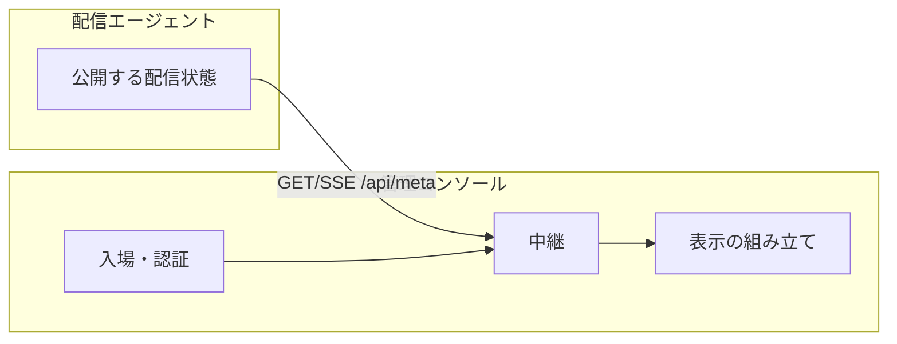

# 管理コンソールの設計

| 項目 | 内容 |
|------|------|
| **状態** | 実装済み（初期範囲） |
| **概要** | [overview.md](./overview.md)。本文書は **管理コンソール** の詳細 |
| **制約** | 観測できる動きを変えない（変えるならテストを先に直す） |

> `docs/` はサイト用。設計メモは `architecture/` に置く。

## 背景

配信エージェント本体は分割済み。管理コンソール側には次が残っていた。

- 外側の HTTPS + IP 制限 + 内側への中継（`console/index.ts`）
- 配信状態の **表示の組み立て**（`createAgentStatusRows` など）
- 配信 API への SSE / HTTP 中継（`lib/console-proxy.ts`）

## 配信エージェントとの関係



| 部品 | やること | 置き場所 |
|------|----------|----------|
| 入場・リダイレクト・Basic 認証の規則 | 拒否時の飛ばし先、本番だけの IP 制限など | `lib/domain/console/access.ts` |
| パスワードの読み書き | 環境変数 / ファイル / 初回生成 | `lib/consoleBasicAuthPassword.ts` |
| 表示の組み立て | 行の有無・文言（副作用なし） | `lib/domain/console/agentStatusPlan.ts` |
| 画面 UI | JSX・レイアウト | `console/src/AgentStatus/*` |
| 起動と中継 | TLS・プロキシ・WebSocket | `console/index.ts` |

## 用語（管理コンソール）

| 用語 | 意味 |
|------|------|
| 外側サーバ | ポート 443 の HTTPS。許可 IP のあと内側へ転送 |
| 内側のコンソール | 127.0.0.1 だけで動く管理画面本体 |
| 配信指標の行 | タイトル・来場者など meta とコメント数の表示 |
| 発話不可の表示 | canSpeak=false のときの「（コメントしてね）」など |
| 表示できる履歴 | 発話文として扱え、nGram または nodes があるもの |

## 守る動き

1. **入場**: `/console/*` を拒否 → 303 で視聴 URL。それ以外 → 308 で `/console/`。IP 制限は本番のみ。
2. **内側へ渡すヘッダ**: hop-by-hop と Host / Origin / Referer を落とす。
3. **行の順**: 指標 → ゲーム → n-gram → 履歴または返信 → 発話（`planAgentStatusRows` と UI が同じ順）。

## コード対応

| 領域 | パス |
|------|------|
| 入場の規則 | `lib/domain/console/access.ts` |
| 表示の組み立て | `lib/domain/console/agentStatusPlan.ts` |
| 起動 | `console/index.ts` は `startConsoleServer` だけ公開。access をここから再 export しない |
| UI 用の整形の再 export | `console/src/AgentStatus/agentStatusUtils.tsx` |
| 公開状態の型 | `lib/domain/publication/types.ts` と console 側 types を揃える |

## 追加で入れたもの

| 領域 | パス |
|------|------|
| SSE の区切り・完全なフレーム | `lib/domain/console/sseFrames.ts` |
| 外側 WebSocket の橋 | `composition/consoleOuterWebSocket.ts` |
| 中継本体 | `lib/console-proxy.ts` |

## 今後（任意）

- 外側 `fetch` ハンドラ全体を composition へ移し、`console/index.ts` を配線のみにする
- AGT 更新は不要（コンソールは HTTP/SSE クライアント）

## 検証

```
bun run typecheck
bun run test
bun run test:integration
```
