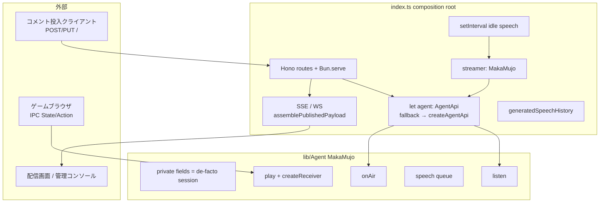
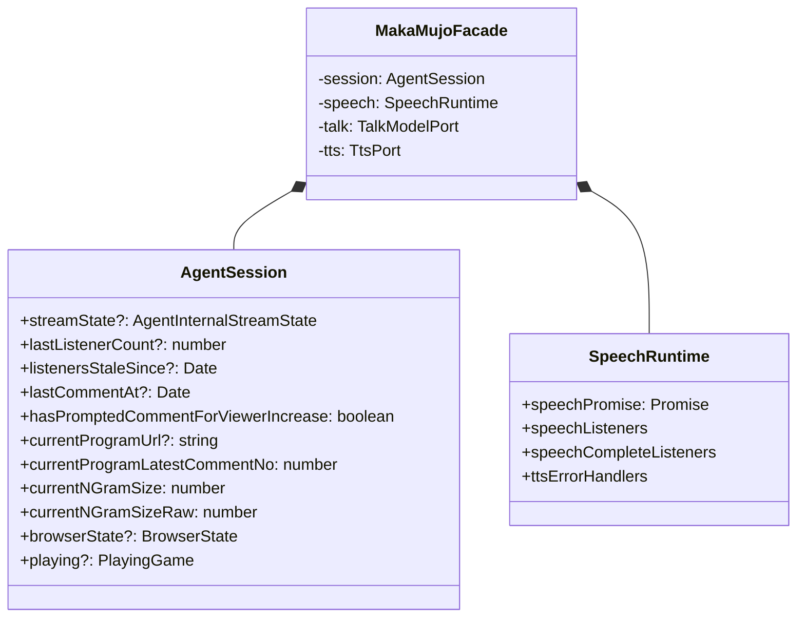
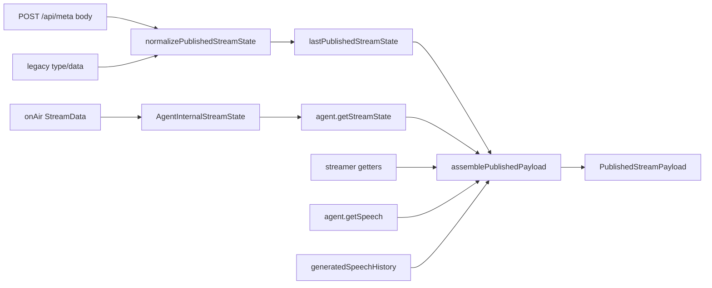
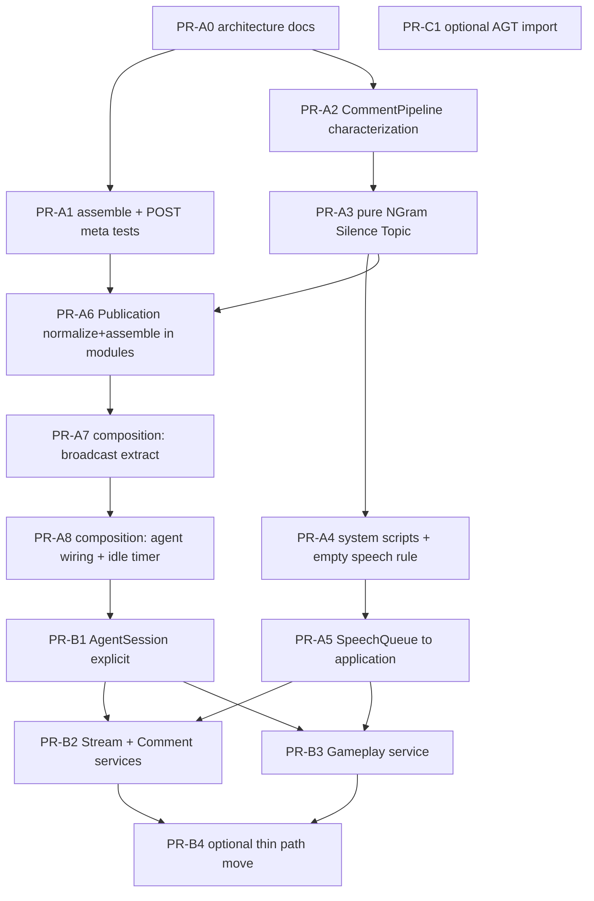

# 馬可無序 (makamujo): ドメインモデル駆動による変更容易性再設計

| 項目 | 内容 |
|------|------|
| **Document** | Domain-model-driven redesign for changeability |
| **Author** | (placeholder) |
| **Date** | 2026-07-11 |
| **Status** | Approved（Rev.3）; Phase A/B 実装済; Phase C AGT `./agent` 対応 |
| **概要** | [overview.md](./overview.md)。本文書は **配信エージェント** の詳細 |
| **Runtime** | Bun 1.3.x, TypeScript strict |
| **Key dependency** | `automated-gameplay-transmitter` ^0.6.4 |
| **Constraint** | **観測可能な振る舞いを意図的に変更しない**（behavior-preserving refactor + characterization / regression tests） |

**関連パス（分割ドキュメントは今後の PR で切り出してもよい）**

| パス | 内容 |
|------|------|
| `architecture/README.md` | 索引 |
| `architecture/overview.md` | 全体の分かれ方・用語・状態の持ち方 |
| `architecture/domain-model-redesign.md` | 本設計書（配信エージェント） |

> **配置方針**: 既存 `docs/` は静的サイト資産（`index.html`, OGP, favicon 等）専用。エンジニアリング文書は **`architecture/`** に置く（`docs/*.md` と混在させない）。

---

## Overview

馬可無序は AI VTuber のアプリケーション層である。現状の中核は `lib/Agent/index.ts`（**ファイル約 489 行**、うち `MakaMujo` クラス本体が大部分）であり、トークモデル、TTS 発話キュー、ブラウザ IPC 経由のゲームソルバ、ニコ生コメント反応、広告/ギフト/クルーズのシステム発話、沈黙ポリシー、n-gram 推定、配信状態のミューテーションが単一オブジェクトに混在している。

配信状態は **二系統** である:

1. **エージェント内部** `AgentInternalStreamState` — `onAir` が書く `{ type: 'live', meta?, replyTargetComment? }`（offline は `undefined`）
2. **公開** `PublishedStreamPayload` — SSE/WS/`GET /api/meta` が返す `{ niconama, canSpeak, … }`（レガシー正規化経由）

本設計は、**用語の意味と機能の境界を先に固定し**、振る舞いを保ったまま直しやすくすることを目的とする。実装の核は **単一の可変 `AgentSession`** にランタイム状態をまとめ、サービスはそれを読み書きする形にすることである。外から見える入口（`MakaMujo` など）は互換を保つ。

**実装フェーズ**: Phase A（契約文書・characterization・純関数・Publication）でリスクの大半を下げ、Phase B（サービス/ファサード）は Phase A の学びを条件に進める。Phase C（任意 AGT）は独立。

---

## Background & Motivation

### 現状アーキテクチャ（要約）



**重要**: `streamer`（`MakaMujo`）と `agent`（`AgentApi` またはインメモリ fallback）は **別オブジェクト**。dynamic import 成功時のみ `agent = createAgentApi(streamer)` で置換する。公開ペイロードは両者 + `lastPublishedStreamState` + 履歴を合成する。

### 痛みポイント

1. **God object (`MakaMujo`)** — `lib/Agent/index.ts` 約 489 行。共有 private フィールドの更新順序が振る舞いそのもの。
2. **二重の状態モデル** — 内部 `AgentState` と公開 `PublishedStreamPayload` が未命名のまま混線。
3. **巨大 composition root** — `index.ts` 約 698 行。
4. **AGT / IPC 境界** — `createAgentApi` は dynamic import; ゲーム側 `createReceiver` は `lib/Browser/socket.ts` 経由で `automated-gameplay-transmitter/server` を **play 時** にバインド。
5. **契約の断片化** — silence/n-gram 等の unit は厚いが、ホスト合成・CommentPipeline 全文は文書化されていない。

---

## Goals & Non-Goals

### Goals

1. 用語と機能の分かれ方を文書化し、**`AgentSession` による状態所有**を固定する。
2. **CommentPipeline / silence 決定表 / Publication 二重モデル**を基準となる契約にする。
3. 純関数ポリシー抽出と Publication アセンブラ集約で変更容易性を上げる（Phase A）。
4. 必要ならアプリケーションサービスへ段階分割（Phase B）。ファサード public API は維持。
5. Characterization を構造移動前または同時に整備。
6. AGT 変更は必要時のみ・互換維持。

### Non-Goals

- 沈黙閾値・プロンプト文言・n-gram 式・TTS パラメータの仕様変更
- AllowedIP / IPC 認証の強化（**脅威モデルは現行のまま**）
- 新プラットフォーム実装
- UI 刷新、Markov 精度改善
- `docs/` 静的サイトへの md 混在
- Windows での POSIX スクリプト完全ネイティブ化

---

## 用語集

| 用語（日本語） | 英語識別子 | 定義（現行コード） |
|----------------|------------|-------------------|
| 配信 / 生放送 | Stream / Live | `onAir` の `isLive` |
| 番組 | Program | URL で識別。URL 変更でコメント番号・prompt フラグをリセット |
| コメント | Comment | 受信ペイロード。**全コメント**が沈黙時計を更新（システム含む） |
| ユーザコメント番号 | CommentNumber | `typeof no === 'number' && no > 0` — n-gram 更新・番組カウント用 |
| 学習対象コメント | LearnableComment | **`no` が truthy**（`no > 0` と同一ではない。`no === 0` は学習しない）**または** `isOwner` |
| 返信生成トリガ | ReplyTrigger | `no` truthy、または (`userId === 'onecomme.system'` かつ `name === '生放送クルーズ'`) |
| システムメッセージ | SystemMessage | `userId === 'onecomme.system'` |
| 生放送クルーズ | NiconamaCruise | 引用開始定型、および name 付きクルーズコメントの返信対象 |
| ギフト | Gift | `hasGift && !isAd`。表示名は `origin.message.gift.advertiserName` |
| 広告 | Ad | システム文が `広告しました` で終わる。`isAd` でギフト分岐を抑止 |
| 発話 / 発話キュー | Speech / SpeechQueue | `#speechPromise` 直列。空/空白は TTS スキップ、リスナは通知。エラーは `.catch(() => Promise.resolve())` でチェーン継続 |
| 沈黙ポリシー | SilencePolicy | `speechable` の純判定（時計 + ブラウザ状態） |
| コメント促し | CommentPrompt | `onAir` 内の副作用。同一 SpeechQueue + 一時 TTS エラーハンドラ |
| 返信対象コメント | ReplyTargetComment | `{ text, pickedTopic }` |
| 話題語 | Topic | Segmenter 最長候補から乱択。`pickTopic` は空文字シード reverse から始め、**空文字 topic は falsy で発話スキップ** |
| 学習 | Learning | `TalkModel.learn(\`${nfcTrim}。\`)`（条件は LearnableComment） |
| n-gram | NGramSize | Broadcasting が comment number から導出; Talk は生成時に消費するだけ |
| エージェント内部配信状態 | AgentInternalStreamState | `onAir` 出力。AGT 薄い `StreamState` を拡張 |
| 公開配信ペイロード | PublishedStreamPayload | コンソール `AgentStateResponse` と整合する合成結果 |
| 配信エージェント API | AgentApi | AGT `createAgentApi` または fallback |
| 配信ホスト | streamer | `MakaMujo` インスタンス（`index.ts` の `streamer`） |

---

## 機能の分かれ方

| Context | 責務 | 所有する不変条件 / 状態 |
|---------|------|-------------------------|
| **Broadcasting** | 番組 URL、視聴者時計、**n-gram 導出**、内部 stream state、沈黙判定入力、CommentPrompt **判定** | `AgentSession` の stream/silence/ngram/program フィールド（後述） |
| **Comment Interaction** | CommentPipeline 順序、分類、システム定型、ギフト/広告 | パイプライン仕様そのもの（状態書き込みは Session 経由） |
| **Talk / Learning** | マルコフ生成・学習・JSON | **n-gram は所有しない**。`generate(start, n)` の `n` は引数 |
| **Speech Delivery** | SpeechQueue（**application 層**）、TTS port、リスナ | キュー promise、リスナ配列 |
| **Gameplay** | solver、IPC、`#browserState` / `#playing` | browser/playing（`speechable` の browser ゲート） |
| **Publication** | 正規化、assemble、POST meta パイプライン、履歴バッファ（host） | `lastPublishedStreamState` は host; 正規化は純関数 |
| **Console** | `/api/meta` プロキシ・AgentStatus UI | 5s timeout → 502 |
| **ACL AGT** | AgentLike / AgentApi | getter 表面・fallback 置換 |
| **ACL Niconama** | StreamData / Comment blob | 文字列 gift/ad → number |

**NGram の所有者（確定）**: **Broadcasting**。`NGramPolicy` は `lib/domain/broadcasting/NGramPolicy.ts`。Talk はサイズを受け取って生成するだけ。

**CommentPrompt の handoff（確定）**:

1. 純関数 `CommentPromptPolicy.shouldPrompt(...)`（Broadcasting domain）
2. `StreamApplicationService.onAir`（または facade 内）が true なら **SpeechQueue.enqueueText('コメントしていってね〜')** し、一時 `onTtsError` でフラグクリア（application）

---

## Runtime state ownership（AgentSession）

### 採用モデル

**単一可変集約 `AgentSession`** が、旧 `MakaMujo` の private フィールドをすべて保持する。アプリケーションサービス（および Phase A の facade メソッド）は **`AgentSession` への参照を受け取り**、その場で読み書きする。サービス間で状態を複製・同期しない。

Phase A ではフィールドは当面 `MakaMujo` 上に残してよい（**事実上の AgentSession**）。Phase B で明示クラス/モジュール `AgentSession` に移し、facade が保持する。



### フィールド別: 単一 Writer / Readers

| フィールド | 単一 Writer | Readers |
|------------|-------------|---------|
| `streamState`（本体 meta） | **Broadcasting** (`onAir`) | Publication（streamer.streamState）、Comment（replyTarget 書き込み時に存在確認） |
| `streamState.replyTargetComment` | **Comment** (pipeline step 6) | Publication（内部 state 経路）、UI |
| `lastCommentAt` | **Comment** (pipeline step 2; **全コメント**) | SilencePolicy |
| `hasPromptedCommentForViewerIncrease` | **Comment** (step 3 で false); **Broadcasting** (prompt 成功予約で true / TTS 失敗で false) | SilencePolicy, CommentPromptPolicy |
| `lastListenerCount`, `listenersStaleSince` | **Broadcasting** (`onAir`) | SilencePolicy, CommentPromptPolicy |
| `currentProgramUrl`, `currentProgramLatestCommentNo` | **Broadcasting** (URL 変更リセット); **Comment** (step 8 で no 代入) | streamState.meta.total.comments 更新 |
| `currentNGramSize`, `currentNGramSizeRaw` | **Broadcasting 指標として Comment pipeline step 4**（Session 上の n-gram フィールド） | Talk generate、Publication、speech イベント付与 |
| `browserState`, `playing` | **Gameplay** (IPC callback) | SilencePolicy（browserOk）、Publication currentGame、Component |
| SpeechRuntime 全体 | **Speech** のみ | host listeners |

> Writer が複数行に見える行は **同一集約への異なるユースケース**（Comment vs Broadcasting）であり、トランザクション境界は「1 `listen` 呼び出し」または「1 `onAir` 呼び出し」単位。並行ライターは設けない（単一スレッドのイベントループ）。

### PR への含意

- PR-A3 等の純関数抽出: Session 不要（入出力のみ）。
- PR-B1/B2/B3: **同一 `AgentSession` 参照を注入**。サービスが独自コピーを持たないこと。
- PR-A5: SpeechRuntime を Session と分離してよい（発話キューは stream メタと寿命が異なる）。

---

## CommentPipeline specification（基準となる契約）

`MakaMujo.listen` と **同一順序**。PR-A2（characterization）/ PR-B2（service 化）の完了条件。実装前に `architecture/maka-mujo-invariants.md` とテストへ落とす。

各要素 `{ data }` について:

| Step | 処理 | 備考 |
|------|------|------|
| 1 | `comment = data.comment.normalize('NFC').trim()` | 原文 `commentData.comment` はシステム照合で別途使う箇所あり（クルーズ開始文は **normalize 前の `commentData.comment` と完全一致**） |
| 2 | `lastCommentAt = now` | **システム含む全コメント**。沈黙解除に効く |
| 3 | `hasPromptedCommentForViewerIncrease = false` | 促し後の沈黙を解除可能にする |
| 4 | `no` が number かつ `> 0` なら n-gram 更新 | `no === 0` では n-gram 不変 |
| 5 | `data.no \|\| data.isOwner` なら `learn(\`${comment}。\`)` | truthy `no`（`0` は学習しない）。**オーナーは no なしでも学習** |
| 6 | `data.no \|\| (userId==='onecomme.system' && name==='生放送クルーズ')` なら topic 抽選 → `topic` truthy なら replyTarget 設定 + `speech(generate(topic,n))` | クルーズ通常コメントはここで返信しうる |
| 7a | system かつ原文が `「生放送クルーズさん」が引用を開始しました` → 定型 4 発話 → **`continue`** | step 8–9 スキップ |
| 7b | system かつ原文 `endsWith('広告しました')` → `isAd=true`、名前抽出、広告お礼 → **`continue`** | |
| 7c | system かつ原文 `=== '配信終了1分前です'` → 定型 4 発話 → **`continue`** | |
| 8 | `no > 0` かつ `currentProgramUrl` あり → `currentProgramLatestCommentNo = no`（**Math.max しない**）し meta.total.comments 更新 | 順序逆転で減少しうる |
| 9 | `hasGift && !isAd` → ギフトお礼（匿名分岐）→ **`continue`** | 広告 continue 後は到達しない |

**クルーズの二重経路**: step 6 で name=生放送クルーズの一般文に返信し、step 7a の「引用開始」固定文は **continue 前に step 6 も実行済み**（固定文に `no` が無ければ step 6 の第一条件は false; name がクルーズなら step 6 第二条件で topic 発話した **後に** 7a の歓迎 4 発話が積み上がる）。characterization で固定文 + name の組み合わせを固定する。

**必須追加テスト（未カバー想定）**:

- システムメッセージが `lastCommentAt` を更新し speechable に影響すること
- 広告短絡でギフトが二重発話しないこと
- `isOwner` かつ `no` なしで learn
- `no === 0` で learn/generate/n-gram 更新なし（既存あり）
- 番組コメント番号が小さい `no` で上書きされうること（非単調）

### Before/After（実装イメージ）

After も **上記 step 表をそのままコード化**する。単純な「user vs system」二分は禁止。

```typescript
// CommentPipeline.run(session, speech, talk, data, clock, random) は
// 上記 step 1–9 をこの順で実行する。分割は関数抽出のみ可。
```

---

## Stream state: dual model + Publication

### 型の分離

```typescript
/** onAir / MakaMujo.streamState — エージェント内部 */
export type AgentInternalStreamState = {
  type: 'live';
  meta?: StreamMeta;
  replyTargetComment?: ReplyTargetComment;
};
// offline / 未配信: undefined（onAir が #streamState = undefined）

/**
 * GET /api/meta, SSE, WS, console AgentStateResponse と整合する公開形。
 * speech は agent.getSpeech() 由来で { speech: string; silent: boolean } になりうる。
 */
export type PublishedStreamPayload = {
  niconama: unknown; // 通常 { type?: string; meta?: StreamMeta } または {}
  canSpeak: boolean;
  currentGame: unknown | null;
  nGram: number;
  nGramRaw: number;
  speech: { speech: string; silent: boolean } | unknown;
  speechHistory: unknown[];
  replyTargetComment?: ReplyTargetComment;
  commentCount?: number;
};
```

`normalizePublishedStreamState` は **公開/レガシー入力専用**。`onAir` が書く内部形を正規化する関数ではない。



### `assemblePublishedPayload`（`getCurrentStreamPayload` 契約）

**入力**:

| 入力 | 出典 |
|------|------|
| `lastPublished` | host `lastPublishedStreamState` |
| `agentStreamState` | `agent.getStreamState?.()` |
| `streamer` | `canSpeak`, `currentGame`, `currentNGramSize(Raw)`, `streamState?.meta?.total?.comments` |
| `speechState` | `agent.getSpeech()` |
| `history` | `generatedSpeechHistory` |
| 定数 | SSE 履歴長 20、バッファ 200（バッファは host） |

**base 選択（フィールド優先の前に必ずこれ）**:

```
streamStateForBase =
  (lastPublished === undefined || lastPublished === null)
    ? agentStreamState
    : lastPublished;

base = normalize(streamStateForBase) as object | {}
agentBase = normalize(agentStreamState) as object | {}
```

**重要**: `lastPublished` が非 null のとき、**`niconama` は base のみ**。内部 agent の meta を niconama にマージしない。

| 出力フィールド | 規則 |
|----------------|------|
| `niconama` | `base.niconama ?? {}` |
| `canSpeak` | `base.canSpeak ?? streamer.canSpeak` |
| `currentGame` | `base.currentGame ?? streamer.currentGame ?? null` |
| `nGram` / `nGramRaw` | `base.* ?? streamer.currentNGram*` |
| `speech` | `base.speech ?? speechState`（`{ speech, silent }`） |
| `speechHistory` | base が配列ならそれ、否则 history。`.slice(0, 20)` |
| `replyTargetComment` | base にあればそれ、**なければ agentBase**（streamer ではない） |
| `commentCount` | `base.commentCount ?? streamer.streamState?.meta?.total?.comments` |

**Characterization fixture（必須）**: `lastPublished` 非 null + 内部 state のみに `replyTargetComment` がある場合 → 公開の replyTarget は agent 経路から出る。`niconama` は lastPublished 側のまま。

### POST `/api/meta` パイプライン（番号付き）

`index.ts` 準拠:

1. JSON body パース（失敗 → 400 `{}`）
2. `replyTargetComment` 抽出: body 直下、なければ `body.data.replyTargetComment`
3. `published = body`; `published` が object かつ **`type` 無し** かつ **`data` 有り** → `published = body.data`
4. `agent.publishStreamState?.(published)`（例外は warn）
5. `published = normalizePublishedStreamState(published)`
6. step 2 の replyTarget が defined なら published に載せる（published 非 object なら `{ replyTargetComment }`）
7. `lastPublishedStreamState = published`
8. WS + SSE に `assemblePublishedPayload(...)` を送出
9. `Response.json({})`（致命時 500）

---

## Proposed Design（構造）

### Domain services（純関数）

| サービス | 配置 | 役割 |
|----------|------|------|
| `SilencePolicy.evaluate` | `domain/broadcasting` | 決定表（後述） |
| `CommentPromptPolicy.shouldPrompt` | `domain/broadcasting` | onAir 用判定のみ |
| `NGramPolicy` | `domain/broadcasting` | raw/size |
| `TopicPicker.pick(text, random)` | `domain/comments` | PR-A3 既定: 内部で `Math.random` 可。RandomPort は任意で後付け |
| `CommentPipeline` steps の判定ヘルパ | `domain/comments` | 分類は pipeline の一部として順序固定 |
| `SystemSpeechScripts` | `domain/comments` | 文言定数 |
| 空発話ルール | `domain/speech/emptySpeech.ts` | trim 空 → TTS スキップ（キュー実装は application） |

### Application / adapters

| コンポーネント | 配置 |
|----------------|------|
| `SpeechQueue` | **`lib/application/SpeechQueue.ts`**（domain ではない） |
| Stream/Comment/Gameplay services | `lib/application/*`（Phase B） |
| `assemblePublishedPayload` / normalize | `lib/domain/publication` または `lib/application/publication`（normalize は副作用なし → domain 可） |
| TTS / Browser socket / file store | `lib/adapters/*` または現行パス re-export |

### AgentLike surface checklist

`createAgentApi(streamer)` が読む **プロパティ**（メソッド呼び出しではない）:

| メンバー | 種類 | 実装 |
|----------|------|------|
| `canSpeak` | **getter** | `return this.speechable` |
| `currentGame` | **getter** | `return this.#playing` / session.playing |
| `streamState` | **getter** | internal state |
| `onAir` | method | Broadcasting |
| `listen` | method | CommentPipeline |

追加の public（AgentLike 外・host が使用）: `speechable`, `playing`, `currentNGramSize`, `currentNGramSizeRaw`, `Component`, `talkModel`, `speech`, `onSpeech`, `onSpeechComplete`, `onTtsError`, `onGameStateChange`, `play`。

### streamer vs agent（host）

| オブジェクト | 役割 |
|--------------|------|
| `streamer` | 常に `MakaMujo`。idle speech・play・nGram・canSpeak のソース |
| `agent` | 初期: in-memory fallback（`setSpeech`/`getSpeech`/`publishStreamState`/`postComments`…）。AGT 成功後: `createAgentApi(streamer)` に **置換** |
| 置換レース | 起動直後リクエストは fallback でよい（現行）。composition 抽出後も **単一 `let agent`** と async IIFE を維持 |
| 観測 | ログ `[INFO] external agent API initialized` を **operability 不変条件**として残す（失敗時は既存 WARN） |

### createReceiver / IPC

- `play()` → `lib/Browser/socket.ts` の `createReceiver` → AGT **server** entry。
- PR-C1 の「createAgentApi の import 衛生」は **IPC bind を消さない**。
- Non-goal: play 経路の named-pipe 副作用除去（必要なら別 AGT 課題）。

### Re-export グラフ（循環回避）

```
lib/Agent/types.ts          ← TalkModel, TTS, SILENCE_THRESHOLD_MS, SpeechEvent（AGT 非依存）
lib/Agent/index.ts          ← MakaMujo facade + re-export types
lib/MarkovChainModel        ← import type TalkModel from ./Agent/types または lib/Agent/types
lib/TTS                     ← import type TTS from types
lib/server.ts               ← re-export MakaMujo, Markov, TTS（現行維持）
lib/domain/*                ← AGT 型を import しない（BrowserState は host ローカル alias）
```

Ports は AGT を直接参照せず:

```typescript
export type BrowserStateName = string; // 'idle' | 'result' | 'closed' | ...
export type GameAction = unknown;
export type GameViewState = unknown;
```

### SilencePolicy（`speechable`）— getter と同一の順序アルゴリズム

**正本は順序付きアルゴリズム**であり、ワイルドカード行の決定表ではない。`lib/Agent/index.ts` の `get speechable` と一致させる（PR-A3 抽出時のゴールデン）。

```
// 定義（thresholdMs = SILENCE_THRESHOLD_MS）
listenersStale =
  listenersStaleSince !== undefined
  && (now - listenersStaleSince) >= thresholdMs

commentsStale =
  lastCommentAt === undefined
  || (now - lastCommentAt) >= thresholdMs

browserOk =
  (browserStateName ?? 'idle') ∈ { 'idle', 'result', 'closed' }

// 評価順（早期 return）— 実装はこの順を崩さない
function evaluateSpeechable(...): boolean {
  if (streamStateDefined) {                    // #streamState !== undefined
    // (1) 促し後: コメントが stale なら listeners の新鮮さに無関係に false
    if (commentsStale && hasPrompted) {
      return false
    }
    // (2) 視聴者・コメント双方 stale
    if (listenersStale && commentsStale) {
      return false
    }
  }
  // (3) ブラウザゲートは常に最後（stream 未設定でも適用）
  return browserOk
}
```

**重要な優先順位**: `commentsStale && hasPrompted` は **`listenersStale` より先**に評価される。したがって:

| streamStateDefined | listenersStale | commentsStale | hasPrompted | browserOk | speechable | 根拠 |
|--------------------|----------------|---------------|-------------|-----------|------------|------|
| F | * | * | * | T | **true** | 時計ブロック skip → browserOk |
| F | * | * | * | F | **false** | browserOk |
| T | F | T | **T** | T | **false** | (1) 促し優先（listeners 非 stale でも沈黙） |
| T | T | T | F | T | **false** | (2) 双方 stale |
| T | T | T | T | T | **false** | (1) で既に false |
| T | T | F | * | T | **true** | コメント新鮮 → (1)(2) 非該当 → browserOk |
| T | F | F | * | T | **true** | 同上 |
| T | F | T | F | T | **true** | 促し未済かつ listeners 新鮮 → 発話可 |
| T | * | * | * | F | **false** | (3) ゲーム中など |

既存 `lib/Agent/index.test.ts` の speechable / prompt 群も回帰ゴールデンとして維持する。特に「視聴者増で 1 回プロンプト後、listeners が新鮮でも `speechable === false`」を characterization に含める（上表 3 行目）。

純関数シグネチャ:

```typescript
SilencePolicy.evaluate({
  now,
  streamStateDefined: boolean,
  listenersStaleSince?: number, // Date.getTime() 相当
  lastCommentAt?: number,
  hasPrompted: boolean,
  browserStateName?: string,
  thresholdMs: typeof SILENCE_THRESHOLD_MS,
}): boolean
// 実装は上記 evaluateSpeechable と意味的に同一であること
```

### CommentPrompt use case（onAir）

前提: live、番組 URL 処理済み、`listeners` が前回と異なる。

1. `listenersStaleSince = now` 更新、`lastListenerCount` 更新  
2. pure: `hadCommentBefore && commentsStale && !hasPrompted`  
3. true なら `hasPrompted = true`、一時 TTS エラーハンドラ登録、**`SpeechQueue` 経由**で `'コメントしていってね〜'`（`additionalHalfTone: 3`, `speakingRate: 1.2`）  
4. 当該テキストの TTS 失敗 → flag false、ハンドラ除去  
5. メイン発話ブロック中はキュー待ち（即時バイパスしない）— 既存テスト固定

### Module structure（改訂）

```
lib/
  domain/
    broadcasting/     SilencePolicy, CommentPromptPolicy, NGramPolicy, ProgramCommentTracker
    comments/         TopicPicker, SystemSpeechScripts, CommentPipeline helpers
    speech/           emptySpeech rule only
    publication/      normalizePublishedStreamState, types dual-model
  application/
    SpeechQueue.ts
    assemblePublishedPayload.ts   # host 合成でも可
    StreamApplicationService.ts   # Phase B
    CommentApplicationService.ts
    GameplayApplicationService.ts
    AgentSession.ts               # Phase B 明示化
  Agent/
    types.ts
    index.ts                      # facade（長い間 in-place 編集で可）
    State.ts
    games/
  Browser/ TTS/ MarkovChainModel/ # 当面現状 + types 依存整理
composition/                      # Phase A 後半〜 B
  broadcast.ts
  agentWiring.ts
  idleSpeechTimer.ts
  httpApp.ts
architecture/                     # 設計 md（docs/ と分離）
```

---

## Alternatives Considered

### A. ビッグバン書換え — 不採用（回帰切り分け不能）

### B. Nest 風フル DI / workspaces — 不採用（過剰）

### C. イベントソーシング — 不採用

### D. ストラングラー + AgentSession + 段階サービス — **採用（Phase B まで含む場合）**

### E. 浅いモジュール化（shallow modularization）— **Phase A の実質ターゲット / 十分な停止点になりうる**

| 長所 | 短所 |
|------|------|
| 純関数 + Publication 集約 + 薄い index 分割だけで変更容易性の大半 | サービス境界の明示は弱い |
| PR・レビュー負荷が小さい | CommentPipeline が巨大関数のまま残りうる |
| 既存テストを最大限再利用 | 領域ごとのオーナーがフォルダ規約に留まる |

**採用基準**:

- **必須**: Alternative E 相当（Phase A）を完了する。
- **Phase B（フル application service）に進む条件**: Phase A 後も `listen`/`onAir` の変更コストが高い、または AgentSession を複数エントリから触りバグった場合。
- **停止してよい条件**: Phase A 後に新規機能が domain 関数追加だけで収まり、facade が薄い委譲のままでレビュー可能。

PR-B4 のパス移動（`MakaMujoFacade.ts`）は **任意**。in-place の薄いクラスで十分ならスキップ。

---

## Characterization / Regression Test Strategy

### 観測可能振る舞い（Observables）の定義

「振る舞い維持」の判定対象:

1. HTTP JSON の **キー集合と意味のある値**（`/api/meta`, `/api/speech`, speech-history）
2. TTS `speech(text, options)` の **呼び出し順と text**
3. `speechable` / `canSpeak` の **時刻線上の真偽**
4. `TalkModel.learn` に渡る文字列
5. 公開 `replyTargetComment` / `commentCount` / nGram
6. コンソールが解釈する形 — fixture [`tests/fixtures/agentStateResponseMock.ts`](C:\Users\nahcnuj\ghq\github.com\nahcnuj\makamujo\tests\fixtures\agentStateResponseMock.ts) と `console/src/AgentStatus/types.ts` の `AgentStateResponse`

内部リファクタの関数分割そのものは observable ではない。

### 既存カバレッジ（再掲・正確化）

| 領域 | 状態 |
|------|------|
| silence / prompt / browser 連携 | **厚い** `lib/Agent/index.test.ts` |
| per-program comments / replyTarget | **あり** |
| n-gram 境界（1…10000 等）・raw・no===0 | **既にあり** — 「主ギャップ」とみなさない |
| normalize 3 経路 | **あり** `streamState.test.ts` |
| speech hooks / empty 周辺 | **部分的** |
| assemblePublishedPayload / base 選択 | **ギャップ** |
| POST `/api/meta` unwrap | **ギャップ** |
| CommentPipeline 全文（system silence, isOwner, ad/gift） | **ギャップ** |
| host: history 200/20, idle timer, model persist, agent fallback | **ギャップ**（テスト or smoke） |
| SpeechQueue `.catch` 継続 | リファクタ時に明示テスト推奨 |

### Phase A テスト方針

- protect-green: 既存スイートを常に維持
- PR-A1: assemble + POST meta characterization（挙動変更なし; テスト容易化のための **最小 extract は可** だが「新仕様発見」はしない）
- n-gram 純関数化時は **既存 it.each を移動**するだけ
- system script 文言は定数化時に完全一致
- host composition PR には smoke checklist 必須

### Done criteria（拡張）

- [ ] `bun run typecheck` / `test` / `test:integration`  
- [ ] Observable checklist を満たす  
- [ ] AgentLike getter checklist  
- [ ] CommentPipeline 仕様とテストが一致  
- [ ] `[INFO] external agent API initialized`（成功時）が残る  
- [ ] コンソール fixture 形の meta が読める  

---

## Security & Privacy

| 項目 | 方針 |
|------|------|
| AllowedIP | `routes/index.ts` の POST 登録 / PUT 検証順を維持 |
| IPC | パス変更しない。ローカル信頼モデルは現行のまま |
| Console proxy | 固定 base URL + timeout |
| **本リファクタは AllowedIP も IPC 認証も強化しない。脅威モデルは変更しない。** | |
| PII（コメント） | ログ・履歴への露出は現行維持 |

---

## Observability & operability

- ログレベルタグ維持: `[DEBUG]` `[INFO]` `[WARN]` `[ERROR]` `[TRACE]`
- **必須ログ**: external agent 初期化成功 INFO / 失敗 WARN
- メトリクス新規追加なし
- **PR-A7 / PR-A8 後 smoke checklist**（composition 抽出後）:
  1. プロセス起動後、ログに fallback 継続 or `external agent API initialized` のどちらかが分かる
  2. `GET /api/meta` → 200、JSON に `niconama`, `canSpeak`, `speech` 等
  3. `PUT /` コメント（AllowedIP 済み）→ 空 `{}`、必要なら meta の replyTarget / history 更新
  4. `GET /api/ws` または SSE でペイロード受信
  5. コンソール agent-status（または mock）が致命的に空でない

Rollback: PR 単位 revert。composition 分割（A7/A8）後は上記 smoke を revert 判定に使う。

---

## Risks

| リスク | 深刻度 | 緩和 |
|--------|--------|------|
| サービス分割時の状態順序バグ | High | AgentSession 単一 Writer 表 + CommentPipeline テスト |
| lastPublished 時 niconama 非マージの誤解 | High | dual-model 文書 + assemble fixture |
| SilencePolicy 抽出時の優先順位誤り | High | **順序アルゴリズム**を正本とし、promoted+commentsStale を listeners より先に評価（PR-A3） |
| Phase B 過剰分割 | Medium | Phase A 停止可（Alt E） |
| composition 巨大 PR | Medium | **PR-A7** broadcast / **PR-A8** wiring+timer に分割 |
| IPC EADDRINUSE | Low | 既存 uncaught 無視ポリシー維持 |
| facade パス移動のノイズ | Low | **PR-B4** 任意 |

---

## Open Questions（defaults 付き）

| # | 問い | 既定（実装ブロックしない） |
|---|------|---------------------------|
| 1 | TopicPicker RNG | **PR-A3 は `Math.random` のまま**。RandomPort はテストで必要なときだけ |
| 2 | AgentState と AGT StreamState の長期関係 | 当面 internal 型を makamujo が所有 |
| 3 | 複数ゲーム | 単一 playing のまま |
| 4 | Idle timer 切り出し | Phase B の `idleSpeechTimer.ts`。flaky なら smoke のみ |
| 5 | AgentStateResponse 単一ソース | Phase A で PublishedStreamPayload を契約名にし、console 型は構造互換をテストで担保 |
| 6 | Phase B をやるか | Phase A 完了後に判断（Alt E 停止可） |

---

## Key Decisions

1. **振る舞い完全維持** — observables 定義に従う。  
2. **`MakaMujo` ファサード + AgentLike getter 表面維持**。  
3. **ランタイム状態は単一 `AgentSession`（Phase A は de-facto 同クラス）**。サービスは共有参照のみ。  
4. **二重モデル**: `AgentInternalStreamState` vs `PublishedStreamPayload`。assemble の base 選択を仕様化。  
5. **NGram は Broadcasting 所有**; Talk は消費のみ。  
6. **SpeechQueue は application**。domain には空発話ルールのみ。  
7. **CommentPipeline 順序表が listen の唯一の正**。  
8. **CommentPrompt = pure 判定 + SpeechQueue 副作用（onAir）**。  
8b. **`speechable` は順序アルゴリズムが正本** — `commentsStale && hasPrompted` を `listenersStale && commentsStale` より先に評価し、最後に `browserOk`。  
9. **AGT は ACL**; nGram を AgentLike に足さない。IPC play 経路は別問題。  
10. **ドキュメントは `architecture/`**（`docs/` 静的資産と分離）。  
11. **Phase A 必須 / Phase B 条件付き / Phase C 任意**（浅いモジュール化を正当な停止点とする）。  
12. **TopicPicker は当面 Math.random**。  
13. **PR-B4 パス移動は任意**。  
14. **依存注入はコンストラクタ、DI コンテナなし**。  
15. **本リファクタはセキュリティ強化を目的としない**。

---

## Rollout Plan（Phase）

### Phase A — 契約・テスト・純関数・Publication（必須）

高変更容易性・低構造リスク。Alternative E 相当。

### Phase B — AgentSession 明示・application services・composition 分割（条件付き）

Phase A 後に listen/onAir 変更コストが残る場合。

### Phase C — 任意 AGT hygiene

createAgentApi の side-effect free import 等。互換 semver。

Feature flag なし。各 PR: `bun run typecheck` && `bun run test` && `bun run test:integration`（該当時）。

---

## References

- `lib/Agent/index.ts` (~489 lines), `lib/Agent/State.ts`, `lib/Agent/index.test.ts` (~614 lines)
- `lib/streamState.ts`, `lib/streamState.test.ts`
- `index.ts` (~698 lines) — `getCurrentStreamPayload`, POST meta, agent fallback
- `tests/fixtures/agentStateResponseMock.ts`, `console/src/AgentStatus/types.ts`
- AGT `Api.d.ts` AgentLike / AgentApi
- `lib/Browser/socket.ts` — createReceiver
- `AGENTS.md`

---

## PR Plan

### 依存関係



**並行可**: A1 と A2; A6 は A1+A3 後でエージェント本体 PR と並行しうる。  
**順序強制**: A5（SpeechQueue）完了前に prompt を別キューへ移す PR を出さない（A5 より前は facade の `speech()` を使い続ける）。

### Phase A

#### PR-A0: architecture 文書配置

- **Title**: `docs: add architecture/ domain model and invariants skeleton`
- **Files**: `architecture/*.md`, 任意で AGENTS.md に architecture へのポインタ
- **Deps**: なし
- **CI**: なし（md のみ）または typecheck 任意
- **Description**: 本設計の言語・AgentSession・CommentPipeline・dual-model をリポジトリへ。`docs/` 静的資産には触れない。

#### PR-A1: Publication characterization

- **Title**: `test: characterize assemblePublishedPayload and POST /api/meta unwrap`
- **Files**: 純関数 extract（最小）`assemblePublishedPayload` + tests; 可能なら POST 経路の単体化
- **Deps**: A0 推奨
- **CI**: `typecheck`, `test`
- **Description**: base 選択・replyTarget の agent フォールバック・lastPublished 時 niconama 非マージを固定。n-gram 新規表は作らない。

#### PR-A2: CommentPipeline characterization

- **Title**: `test: lock comment pipeline order-of-effects`
- **Files**: `lib/Agent/index.test.ts` 追加ケース
- **Deps**: A0
- **CI**: `typecheck`, `test`
- **Description**: system→silence clock、isOwner learn、ad vs gift、cruise 固定文。実装の service 化はしない。

#### PR-A3: 純関数抽出 NGram / Silence / Topic

- **Title**: `refactor(agent): extract NGramPolicy SilencePolicy TopicPicker`
- **Files**: `lib/domain/broadcasting/*`, `lib/domain/comments/TopicPicker.ts`, `lib/Agent/index.ts` 差し替え
- **Deps**: A2 推奨（silence 既存 + pipeline）
- **CI**: `typecheck`, `test`
- **Description**: 既存 n-gram it.each は純関数テストへ **移動**可。Math.random 維持。

#### PR-A4: SystemSpeechScripts + empty speech domain rule

- **Title**: `refactor(agent): extract system speech scripts and empty-speech rule`
- **Files**: `lib/domain/comments/SystemSpeechScripts.ts`, empty speech helper, Agent 差し替え
- **Deps**: A3
- **CI**: `typecheck`, `test`

#### PR-A5: SpeechQueue → application

- **Title**: `refactor(agent): move SpeechQueue to application layer`
- **Files**: `lib/application/SpeechQueue.ts`, Agent 委譲
- **Deps**: A4
- **CI**: `typecheck`, `test`
- **Description**: `.catch` 継続・リスナ・TTS options 維持。domain/ に置かない。

#### PR-A6: Publication モジュール集約

- **Title**: `refactor: centralize stream normalize and published payload assembly`
- **Files**: `lib/domain/publication/*` or application, `lib/streamState.ts` re-export, `index.ts` 利用
- **Deps**: A1, A3
- **CI**: `typecheck`, `test`, `test:integration`（console 系）
- **Smoke**: GET `/api/meta`, SSE
- **Description**: dual-model 型名をコードに導入。console fixture 互換。

#### PR-A7: composition — broadcast 抽出

- **Title**: `refactor: extract SSE/WS broadcast helpers from index.ts`
- **Files**: `composition/broadcast.ts`, `index.ts`
- **Deps**: A6
- **CI**: `typecheck`, `test`, `test:integration`
- **Smoke**: checklist 3–4

#### PR-A8: composition — agent wiring + idle timer + model persist 明示

- **Title**: `refactor: extract agent wiring, idle speech timer, model persistence`
- **Files**: `composition/agentWiring.ts`, `idleSpeechTimer.ts`, model save near PUT handler
- **Deps**: A7, A5（idle が streamer.speech を呼ぶ）
- **CI**: 同上 + smoke フル
- **Description**: `let agent` 置換レースと初期化ログを維持。PUT の `writeFileSync(model)` をここで文書化・モジュール化。

### Phase B（条件付き）

#### PR-B1: AgentSession 明示化

- **Title**: `refactor(agent): introduce AgentSession aggregate`
- **Files**: `lib/application/AgentSession.ts`, MakaMujo が所有
- **Deps**: A8 または A5+A6 完了後
- **CI**: `typecheck`, `test`

#### PR-B2: Stream + Comment application services

- **Title**: `refactor(agent): Stream and Comment application services over AgentSession`
- **Files**: application services, facade 委譲
- **Deps**: B1, A5, A2
- **CI**: `typecheck`, `test`
- **Description**: CommentPipeline をサービスメソッド化。順序表遵守。

#### PR-B3: Gameplay application service

- **Title**: `refactor(agent): extract GameplayApplicationService`
- **Files**: gameplay service, play/IPC
- **Deps**: B1, A5
- **CI**: `typecheck`, `test`; **CI 上の** `test:e2e` IPC ジョブがあればそれ（ローカル Windows は WSL/CI 前提を明記）

#### PR-B4: 任意 facade ファイル移動

- **Title**: `refactor(agent): optional move MakaMujo to adapters path with re-exports`
- **Files**: path move + re-export
- **Deps**: B2, B3
- **Mandatory**: **No** — ノイズが大きいならスキップ

### Phase C（任意）

#### PR-C1: AGT createAgentApi import hygiene

- **Title**: AGT 側 — side-effect-free agent API module
- **Deps**: なし
- **Note**: Browser IPC / createReceiver は対象外

### 各 PR 共通 CI

```
bun --version
bun ci   # 初回・依存更新時
bun run typecheck
bun run test
bun run test:integration   # host/console に触れる PR
```

`test:bin` / `test:e2e` はシェル依存変更時または Gameplay/E2E 関連 PR で CI（POSIX）実行。

---

## Appendix A: 責務マップ

| 領域 | コンテキスト / 層 |
|------|-------------------|
| talkModel / learn | Talk |
| SpeechRuntime / queue | application Speech |
| play / browser / playing | Gameplay |
| CommentPipeline | Comment + Session writes |
| onAir / program / silence clock / n-gram fields | Broadcasting |
| speechable | SilencePolicy + session |
| assemble / normalize / lastPublished | Publication + host |
| AgentLike surface | facade |

## Appendix B: n-gram 式

\[
\text{raw} = 2\log_{10}(\max(1,n))-2,\quad \text{size}=\max(1,\lfloor raw\rfloor)
\]

初期 comment number 1 → raw −2。既存 it.each が契約。

## Appendix C: Program コメント番号

**最後に観測した `no` を格納（単調増加を保証しない）**。URL 変更で 0 にリセット。
