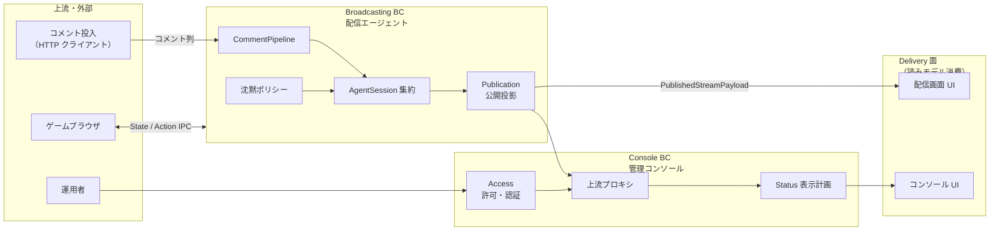
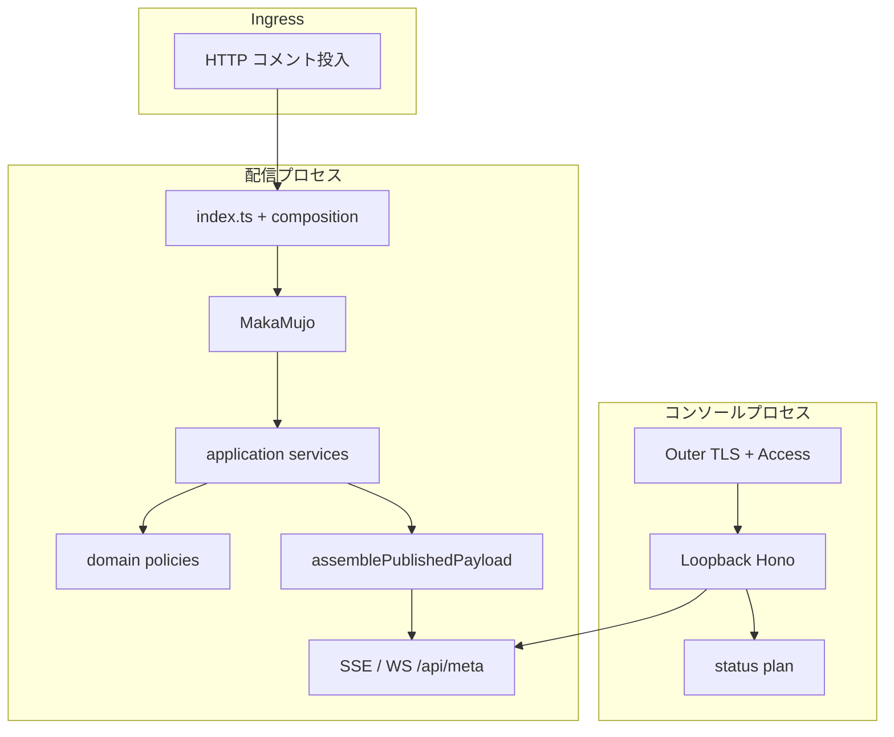

# 馬可無序システム：あるべきアーキテクチャ（main）

| 項目 | 内容 |
|------|------|
| **Document** | Canonical system architecture (normative for `main`) |
| **Audience** | 実装者・レビューア・AI エージェント |
| **Status** | Normative |
| **Approach** | ミノ駆動 — ユビキタス言語と境界づけられたコンテキストを先に固定し、配置・運用はそれに従う |
| **Constraint** | 振る舞い変更は **観測可能な契約（ゴールデンテスト）** を更新してから行う |

> この文書は「Git ブランチのファイル一覧」ではない。  
> **馬可無序というプロダクトが、どの境界で、どの言葉で、どの状態所有の下で動くべきか** を書く。  
> ブランチ間差分や取り込み履歴は書かない（すぐ陳腐化する）。

詳細契約:

- 配信エージェント BC → [domain-model-redesign.md](./domain-model-redesign.md)
- 管理コンソール BC → [console-domain-model.md](./console-domain-model.md)

配置ルール: エンジニアリング文書は `architecture/` のみ。`docs/` はランディング静的資産専用。

---

## 1. プロダクトと目的

**馬可無序（MAKA Mujo）** は、AI がゲームをプレイし、マルコフ連鎖によるトークとコメント反応を伴ってライブ配信する **AI VTuber のアプリケーション層** である。

| 目的 | 説明 |
|------|------|
| 自律プレイ | ゲームブラウザを IPC 経由で操作し続ける |
| トーク | トークモデル生成 → TTS 発話キュー → 視聴者へ提示 |
| コメント反応 | 外部から投入されたコメントを学習・返信トピックとして扱う |
| 配信状態の公開 | 沈黙可否・メタ・履歴などを画面／管理コンソールへ投影 |
| 運用可能 | 本番で起動・停止・認証・再起動できる |

変更容易性の判断は「テストが緑」だけではない。**境界をまたがずに意図を変えられるか**、**言葉が実装と一致しているか** を優先する。

---

## 2. 境界づけられたコンテキスト（コンテキスト地図）



| コンテキスト | 責務（持つもの） | 持たないもの |
|--------------|------------------|--------------|
| **Broadcasting** | コメント処理、沈黙、発話キュー、内部配信状態、公開ペイロードの組み立て | TLS コンソールの IP/Basic、HTML レイアウト |
| **Console** | 誰がコンソールに入れるか、状態の **表示計画**、上流 SSE/HTTP の橋渡し | 沈黙閾値や CommentPipeline の規則そのもの |
| **Delivery 面** | 投影の描画（配信画面・AgentStatus） | ドメイン規則の発明 |
| **ゲームブラウザ** | 画面操作と State 供給（別プロセス） | トークモデル・沈黙 |

**関係の原則**

1. Console は Broadcasting の **公開投影を読む**。内部 `AgentSession` を直接共有しない。
2. コメントの正規化・沈黙・返信トピックは Broadcasting の言葉で決まる。Console は表示と運用アクセスに徹する。
3. ゲーム IPC は Anti-Corruption を `lib/Browser` / AGT 境界に閉じ、Broadcasting は AgentLike 面で触る。

---

## 3. ユビキタス言語（システム横断）

用語はコード識別子とセットで使う。詳細・決定表は各 BC 文書へ。

| 日本語 | 識別子の目安 | 定義 |
|--------|--------------|------|
| 番組 / 配信 | Program / Stream / Live | 生放送の継続単位。URL 変更でコメント番号等がリセットされうる |
| コメント | Comment / AgentComment | 視聴者またはシステムの発話単位。外部から **投入** される |
| コメント投入 | Comment ingress | HTTP 等でプロセスへコメント列を渡す行為（必須経路） |
| CommentPipeline | CommentPipeline | 投入コメントを数え・学習し・返信対象を決める一連の規則 |
| 沈黙 / 発話可能 | Silence / speechable / canSpeak | 視聴・コメントの鮮度に基づく「今しゃべってよいか」 |
| 発話 | Speech | TTS に載せる生成結果。履歴に残りうる |
| 内部配信状態 | Agent internal stream state | エージェントが持つ live/offline と meta（公開前） |
| 公開ペイロード | PublishedStreamPayload | SSE/WS/`/api/meta` が返す **投影**（`niconama`, `canSpeak`, …） |
| 返信先コメント | replyTargetComment | 今回の発話が反応しているコメント |
| AgentSession | AgentSession | Broadcasting のランタイム状態の **単一の所有点**（集約） |
| 外側サーバ | Outer console | :443 TLS。production で IP + Basic |
| ループバックコンソール | Loopback console | 127.0.0.1 上のコンソール本体 |
| 表示計画 | Status plan / rows | 公開ペイロードから「何をどの順で見せるか」の純関数結果 |

用語を変える変更は、識別子・テスト名・UI 文言のどれかが先にずれると事故る。**言葉を先に直し、実装を追従させる。**

---

## 4. 状態所有と投影

```text
                    write                         project
Comment / onAir  ──────────►  AgentSession  ──────────►  PublishedStreamPayload
  (commands)                   （真実の源泉）              （読みモデル）
                                                              │
                                                              ▼
                                                    配信画面 / コンソール表示計画
```

| 対象 | 所有者 | 備考 |
|------|--------|------|
| コメント番号・最終コメント時刻・prompt フラグ等 | `AgentSession`（Broadcasting） | サービス経由でのみ更新 |
| 沈黙判定の入力となる時刻・視聴者数変化 | 同上 | 純関数 `SilencePolicy` が決定に使う |
| 発話キュー中の仕事 | SpeechQueue + TTS ポート | 副作用はポートの外 |
| 公開 JSON | Publication アセンブラが **都度投影** | 内部状態の複製ではなく合成結果 |
| コンソールに見せる行 | Console の plan 純関数 | 公開 JSON を入力に取る。Session を直接読まない |
| Basic auth パスワード | 運用設定（env / ファイル） | ドメイン規則ではなくホスト設定 |

**二系統の stream を混ぜない。** 内部状態のフィールド名と公開 `niconama` 形は意図的に異なる。正規化・assemble は publication 境界に閉じる（[domain-model-redesign.md](./domain-model-redesign.md)）。

---

## 5. アプリケーションの形（BC を壊さない配置）

パッケージは BC を表現するための手段である。**フォルダが BC を定義するのではなく、BC がフォルダを選ぶ。**

| 関心 | 置き場 | 制約 |
|------|--------|------|
| 純規則（沈黙・トピック・Publication・Console access/plan/SSE frames） | `lib/domain/**` | 副作用なし |
| Session に対する操作 | `lib/application/**` | I/O ポートは引数で受ける |
| AgentLike 互換の入口 | `lib/Agent`（ファサード） | 公開 API を不用意に広げない |
| プロセス配線 | `composition/**`, `index.ts` | ドメイン規則をここに書かない |
| コンソール host | `console/index.ts` | Access 純関数を re-export しない |
| コンソール UI | `console/src/**` | 表示とフィクスチャ。`tests/` を import しない |
| 配信画面 UI | `src/**` | 公開投影の消費 |
| HTTP 面 | `routes/**` | 薄いアダプタ |

**Composition / Host に書いてはいけないもの:** CommentPipeline の分岐、沈黙閾値の意味、表示行の順序の発明。それらは domain か、既存ゴールデンの更新を伴う変更にする。

---

## 6. ランタイム連携（実装の見取り図）



### コメント投入（必須の現実）

- **標準の境界**: プロセス外のクライアントが HTTP でコメント列を渡す。
- プロセス内のニコ生 WebSocket / Playwright クライアントは **このシステムの必須コンテキストに含めない**。  
  導入するなら、Comment ingress の Anti-Corruption として切り、Broadcasting の用語に翻訳してから Session に入れる。契約は別設計。

### 管理コンソール（Console BC の運用契約）

| 項目 | 契約 |
|------|------|
| production Access | AllowedIP かつ Basic（user `admin`） |
| 秘密情報 | `CONSOLE_BASIC_AUTH_PASSWORD` 優先。なければ永続ファイル（再起動で回転させない） |
| 上流障害 | SSE 非 2xx を unhandled にしない |
| 表示 | plan 純関数の順序・文言契約を守る |

詳細: [console-domain-model.md](./console-domain-model.md)

---

## 7. 観測可能な契約（ゴールデン）

アーキテクチャ変更の是非は、次が **意図どおり緑／意図どおり更新** されているかで測る。

| BC / 面 | ゴールデン |
|---------|------------|
| Broadcasting: CommentPipeline / speechable / 公開合成 | `lib/Agent/index.test.ts`、`lib/domain/**`、publication テスト |
| Console: Access / plan / SSE frames | `lib/domain/console/*.test.ts` |
| Console host / proxy | `tests/integration/console/**`, `console-proxy*.ts` |
| ゲームブラウザ起動解決 | `lib/Browser/*` 単体 |

ドメイン規則や公開ペイロード形を変えるときは、**先に** 該当 BC 文書の契約節とゴールデンを直し、その後に実装する。

---

## 8. 意図的な非目標（システムとして必須にしない）

| 非目標 | 理由（モデル上） |
|--------|------------------|
| プロセス内ニコ生クライアント必須化 | Comment ingress を別コンテキスト／アダプタにすべきで、Broadcasting を肥大化させない |
| コンソールが Session を直接共有 | 境界破壊。公開投影のみを読む |
| エージェントを単一 God object に戻す | 変更容易性の否定 |
| 沈黙閾値・プロンプト文言の暗黙変更 | プロダクト仕様変更であり、リファクタの名で行わない |
| 運用専用の「systemd のみ・手動起動禁止」 | 開発・検証の経路をモデルから消さない |

---

## 9. 運用アダプタ（短く）

モデルを壊さない範囲のホスト事実。詳細は `etc/systemd/README.md`。

| 項目 | あるべき姿 |
|------|------------|
| 開発・検証起動 | `bin/start` / `bin/stop` |
| 本番 | systemd 親 + screen / browser / obs。`make install` が `@PREFIX@` / `@BUN_BIN@` を置換 |
| Chromium | 既定 bundled。lock 掃除は Singleton* のみ |
| 品質コマンド | `typecheck` → `lint` → `test` → `test:integration`（必要なら e2e） |

ツールバージョンや Biome ルールの細目は **モデルではない**。CI が要求するゲートを満たしつつ、ルール強化はモデル変更と混ぜない。

---

## 10. 変更の進め方（ミノ駆動）

1. **言葉**: 変える概念にユビキタス言語があるか。なければ先に用語を足す。  
2. **境界**: どの BC の責務か。越境していないか。  
3. **所有**: 状態は誰が書くか。投影を書き戻していないか。  
4. **契約**: ゴールデンを先に更新または追加。  
5. **配置**: domain → application → composition/host の順で厚みを足す。  
6. **検証**: typecheck / lint / 該当テスト。  

エージェント作業の入口: [`AGENTS.md`](../AGENTS.md) → 本ファイル → 対象 BC 文書。

---

## 関連

- [domain-model-redesign.md](./domain-model-redesign.md) — Broadcasting BC の詳細契約  
- [console-domain-model.md](./console-domain-model.md) — Console BC の詳細契約  
- [`AGENTS.md`](../AGENTS.md)  
- [`etc/systemd/README.md`](../etc/systemd/README.md) — 運用アダプタの手順  
