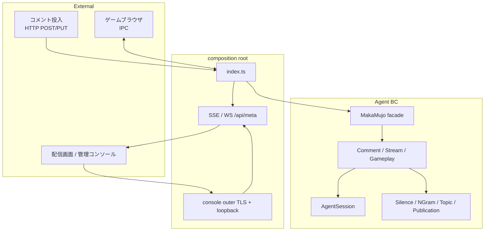

# main ブランチのあるべき姿

| 項目 | 内容 |
|------|------|
| **Document** | Canonical architecture of the `main` branch |
| **Audience** | 実装者・レビューア・AI エージェント |
| **Status** | Normative（この文書が「正しい main」の説明） |
| **Constraint** | 振る舞い変更は契約（観測可能なテスト）を更新してから行う |

> ブランチ間の差分表は置かない。差分はすぐ古くなるため、**あるべき構造と契約だけを書く**。  
> 歴史的経緯（orphan 化・`legacy` 経由の収束など）は不要になったら忘れてよい。

`docs/` はランディング用静的資産専用。エンジニアリング文書は `architecture/` のみ。

---

## 1. 位置づけ

`main` は馬可無序の **既定・デプロイ対象ブランチ** である。

- **配信エージェント**: ドメイン分割済み（CommentPipeline / Silence / Publication）
- **管理コンソール**: Access / Status plan / SSE の純関数 + ホスト配線
- **運用**: systemd 子サービス + `make install`、手動 `bin/start`/`bin/stop` も併用可能
- **品質**: Biome + TypeScript strict + unit / integration / e2e（CI）

エージェント作業時は [`AGENTS.md`](../AGENTS.md) と本ディレクトリの契約を先に読む。

---

## 2. レイヤと配置

```text
index.ts, composition/     composition root（配線・I/O）
lib/application/           アプリケーションサービス（AgentSession 共有）
lib/domain/                純関数ポリシー（副作用なし）
lib/Agent/                 ファサード MakaMujo（AgentLike 互換）
console/                   管理コンソール host + UI
routes/                    HTTP / コンソール API 面
bin/, etc/systemd/         起動・デプロイ
architecture/              設計・契約（本ディレクトリ）
docs/                      静的ランディングのみ
```

| レイヤ | 役割 | 代表パス |
|--------|------|----------|
| Domain | 沈黙・トピック・Publication 組み立て・コンソール Access 等 | `lib/domain/**` |
| Application | Comment / Stream / Gameplay / SpeechQueue | `lib/application/**` |
| Composition | ブロードキャスト、agent wiring、idle timer、outer WS | `composition/**` |
| Host | Bun.serve / TLS コンソール / ルート | `index.ts`, `console/index.ts`, `routes/**` |
| UI | 配信画面・AgentStatus | `src/**`, `console/src/**` |

**原則**

1. ドメインは副作用を持たない。I/O は composition / host に閉じる。
2. 観測可能な契約はテストで固定する（下記）。
3. `console/index.ts` は host 公開面を薄く保つ（access 純関数を re-export しない）。

---

## 3. ランタイム概観



### 3.1 コメント

- **標準経路**: 外部クライアントが HTTP でコメント配列を投入し、エージェントが `listen` / `postComments` する。
- **組み込みニコ生 WebSocket クライアントは main の必須構成に含めない**。  
  必要になった場合は `architecture/domain-model-redesign.md` の契約を壊さない形で **別設計・別 PR** とする。

### 3.2 配信状態の二系統

| 系統 | 用途 | 契約の正本 |
|------|------|------------|
| エージェント内部 stream | `onAir` / 沈黙判定など | [domain-model-redesign.md](./domain-model-redesign.md) |
| 公開 `PublishedStreamPayload` | SSE/WS/`GET /api/meta` | 同上 + `lib/domain/publication/` |

### 3.3 管理コンソール

| 関心 | あるべき姿 |
|------|------------|
| 外側 :443 | production で **AllowedIP + Basic auth**（user `admin`） |
| パスワード | `CONSOLE_BASIC_AUTH_PASSWORD` を優先。未設定時は `var/console-basic-auth-password`（または `CONSOLE_BASIC_AUTH_PASSWORD_FILE`）に永続化して再利用 |
| ループバック | 127.0.0.1 上で Hono ルート本体 |
| 状態表示 | 純関数 plan（`lib/domain/console`）+ UI ファサード |
| 上流 SSE | 非 2xx でも unhandled にせず meta フォールバック等で graceful |
| モック | `?agentStateMock=1`。fixture は **本番安全パス** `console/src/fixtures/`（`tests/` を production から import しない） |

詳細: [console-domain-model.md](./console-domain-model.md)

---

## 4. 運用・デプロイ

| 項目 | あるべき姿 |
|------|------------|
| 手動起動 | `bin/start` / `bin/stop`（開発・検証・test:bin） |
| 本番起動 | systemd 親 `makamujo.service` + 子 screen / browser / obs |
| インストール | `sudo make install PREFIX=... BUN_BIN=...` |
| unit テンプレート | `etc/systemd/*.service` の `@PREFIX@` / `@BUN_BIN@` を install 時に置換 |
| Chromium | 既定は Playwright **bundled**。`CHROMIUM_EXECUTABLE_PATH` で上書き可 |
| lock 掃除 | `SingletonLock` / `SingletonSocket` / `SingletonCookie` のみ（profile 内 `.ssh` 等は消さない） |
| OBS | flatpak + XDG_* を明示 |

詳細は `etc/systemd/README.md`。

---

## 5. ツールチェーンと品質ゲート

| 項目 | あるべき姿 |
|------|------------|
| Runtime | Bun、TypeScript strict |
| 整形 | `bun run format` → `biome format --write .` |
| 静的検査 | `bun run lint` → `biome check --error-on-warnings .` |
| 型 | `bun run typecheck` |
| テスト | `bun run test` → unit（`lib/` `src/` `routes/` `console/src/` `composition/` `docs/`） |
| 統合 | `bun run test:integration` |
| E2E | `bun run test:e2e`（CI で必須） |
| Import 方針 | production コードが `tests/` を import しない（`scripts/check-no-test-imports.sh`） |
| Playwright | 現行メジャー線を維持（bundled Chromium 方針と整合） |

Biome は導入済み。一部ルール（例: `noExplicitAny`）は段階的に厳格化する前提で、**recommended を基に CI は green を保つ**。ルール強化は別コミットで行い、無関係なリライトと混ぜない。

---

## 6. 契約のゴールデン（変更時に壊してはいけないもの）

| 領域 | ゴールデン |
|------|------------|
| CommentPipeline / speechable / publication | `lib/Agent/index.test.ts`、domain 単体、publication テスト |
| Console access / plan / SSE frames | `lib/domain/console/*.test.ts` |
| Console host / proxy | `tests/integration/console/**`, `tests/integration/console-proxy*.ts` |
| ブラウザ executable 解決 | `lib/Browser/*` の単体 |

ドメイン再設計・ペイロード変更では **先に** [domain-model-redesign.md](./domain-model-redesign.md) を確認する。

---

## 7. 意図的に「必須としない」もの

次は main の必須構成ではない（導入するなら契約とテストを先に定義する）。

- プロセス内 **ニコ生 WebSocket / Playwright コメントクライアント** 一式
- 配信サーバから `bin/start` を廃した「systemd のみ」運用（手動起動経路は残す）
- 配信エージェントを単一巨大ファイルに戻すリファクタ

---

## 8. エージェント向け作業手順（要約）

1. `architecture/README.md` → 本ファイル → 対象 BC の詳細設計を読む  
2. 振る舞いを変えない変更は既存ゴールデンを緑のまま  
3. 確認順: `typecheck` → `lint` → `test` → `test:integration`（必要なら e2e / test:bin）  
4. コミットは Conventional Commits  

---

## 関連

- [domain-model-redesign.md](./domain-model-redesign.md) — 配信エージェント BC
- [console-domain-model.md](./console-domain-model.md) — 管理コンソール BC
- [`AGENTS.md`](../AGENTS.md) — リポジトリ作業ルール
- [`etc/systemd/README.md`](../etc/systemd/README.md) — サービス運用
