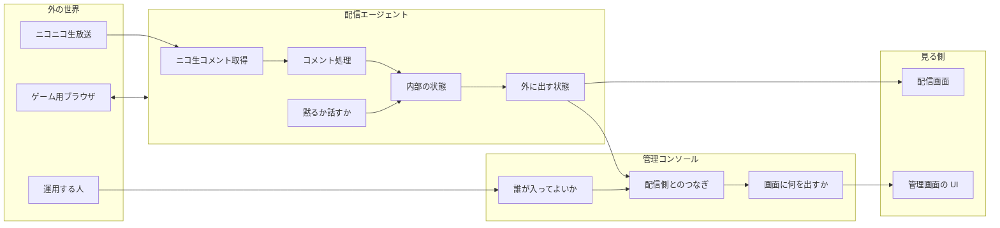
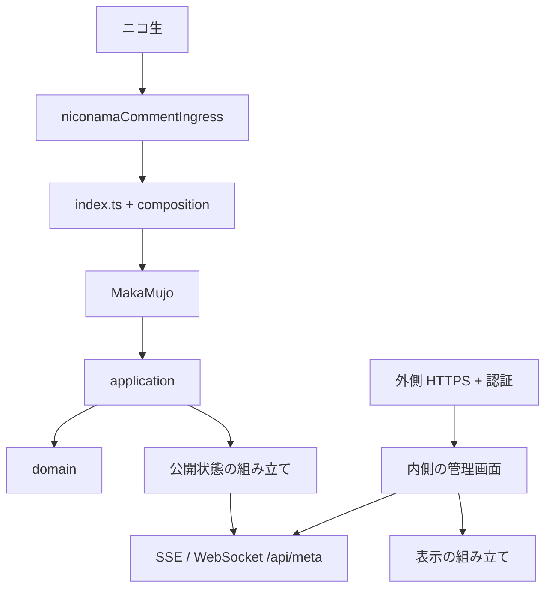

# アーキテクチャ概要

| 項目 | 内容 |
|------|------|
| **方針** | 用語の意味と、機能の境界を先に決めてから実装する |
| **制約** | 動きを変えるときは、先に基準テストを直す |

詳細:

- 配信エージェント → [domain-model-redesign.md](./domain-model-redesign.md)
- 管理コンソール → [console-domain-model.md](./console-domain-model.md)

設計メモは `architecture/` のみ。`docs/` はサイト用の静的ファイル専用。

---

## 1. このプロダクトは何か

**馬可無序（MAKA Mujo）** は、AI がゲームを遊び、トークとコメント反応付きでライブ配信する AI VTuber 用のアプリである。

| やること | 内容 |
|----------|------|
| ゲームを遊ぶ | ブラウザを自動操作する |
| 話す | 文章を作って読み上げる |
| コメントに反応する | ニコ生から取ったコメントを学習し、話題にする |
| 状態を見せる | 配信中かどうか・履歴などを画面と管理画面に出す |
| 運用できる | 起動・停止・ログイン・再起動ができる |

コードを直すときの判断は、「テストが通るか」だけでなく、**別の機能の境界をまたいでいないか**、**同じ言葉が同じ意味で使われているか** を見る。

---

## 2. 機能の分かれ方



| まとまり | やること | やらないこと |
|----------|----------|--------------|
| **配信エージェント** | ニコ生からのコメント取得、黙る／話す、発話、内部状態、外に出すデータの組み立て | 管理画面のログインや HTML |
| **管理コンソール** | 誰が入るか、表示の組み立て、配信 API への中継 | コメント処理や沈黙の規則そのもの |
| **画面** | 受け取った状態の表示 | ビジネス規則の発明 |
| **ゲーム用ブラウザ** | 画面操作と状態の供給（別プロセス） | トークや沈黙の判断 |

1. 管理コンソールは配信エージェントの **外向けのデータだけ** を見る。  
2. コメントの意味・沈黙・返信相手は配信エージェント側で決める。  
3. ゲームとのやりとりはブラウザまわりに閉じる。

---

## 3. コメント（本番契約）

本番のコメント経路は次で確定する（構造は domain 分割、振る舞いは本番向け）。

| 経路 | 仕様 |
|------|------|
| **本線** | プロセス内のニコ生クライアント（`composition/niconamaCommentIngress` → `lib/niconamaCommentClient`）。起動後に遅延 start・リトライ |
| **`POST /` / `PUT /`** | **常に 404**。外部 HTTP でのコメント列投入は使わない |

| 環境変数 | 意味 |
|----------|------|
| `NICONAMA_WATCH_URL` | 視聴 URL |
| `NICONAMA_USER_DATA_DIR` | Playwright プロファイル（既定 `./playwright/.auth/`） |
| `CHROMIUM_EXECUTABLE_PATH` | 任意。未設定なら同梱 Chromium |
| `NICONAMA_START_DELAY_MS` | 起動遅延（既定 350） |
| `NICONAMA_START_MAX_RETRIES` | リトライ回数。`<1` は起動しない（fatal にしない）。e2e では `0` にし、サーバ起動時の本線クライアントは止めつつライブ検証は別テストで行う |
| `NICONAMA_DISABLE=1` | クライアント完全無効（必要なときだけ） |
| `NICONAMA_LIVE_TESTS=1` | ログイン不要の公開視聴ページ向けライブ e2e を有効化（CI で使用） |
| `DEBUG_NICONAMA_COMMENTS=1` | コメント本文をログ |

コメント反応のテストは単体・クライアント lifecycle・**ライブ e2e**（公開番組 `watch/user/14171889` など、未ログインでも見える分）に置き、**HTTP PUT に依存しない**。  
e2e では `NICONAMA_DISABLE` は使わず、`NICONAMA_LIVE_TESTS=1` + `NICONAMA_START_MAX_RETRIES=0` とする（origin/main と同じ）。

---

## 4. 用語

| 日本語 | コード上の名前の目安 | 意味 |
|--------|----------------------|------|
| 番組 / 配信 | Program / Stream / Live | いまの生放送 |
| コメント | Comment | 視聴者やシステムの一言 |
| ニコ生コメント取得 | NiconamaCommentClient | ニコ生からコメントを取るプロセス内クライアント |
| コメント処理の流れ | CommentPipeline | 数え方・学習・返信相手の決め方 |
| 沈黙 / 発話可能 | silence / speechable / canSpeak | いま話してよいか |
| 発話 | Speech | 読み上げる文 |
| 内部の配信状態 | （エージェント内部） | live / 終了とメタ情報 |
| 公開する配信状態 | PublishedStreamPayload | SSE/WS/`/api/meta` が返す形 |
| 返信先コメント | replyTargetComment | いまの発話が反応しているコメント |
| 内部状態の置き場 | AgentSession | 配信エージェントが状態をまとめて持つ場所 |
| 外側サーバ | — | インターネット向け HTTPS（本番は IP 制限とパスワード） |
| 内側のコンソール | — | 127.0.0.1 だけで動く管理画面本体 |
| 表示の組み立て | Status plan | 公開データから何をどの順で出すか |

---

## 5. 状態は誰が持つか

```text
ニコ生クライアント → コメント処理 → AgentSession（書き込み）
                                      ↓
                         公開する配信状態（組み立て）
                                      ↓
                         配信画面・管理画面
```

| もの | 誰が持つか |
|------|------------|
| コメント番号・最終コメント時刻など | 配信エージェントの内部状態 |
| 黙るかの判断材料 | 同上 + 純粋な判定関数 |
| 読み上げ待ち | 発話キューと音声出力 |
| API に載る JSON | その都度組み立てる |
| 管理画面の各行 | 公開 JSON を入力にした表示用の組み立て |
| 管理画面パスワード | 設定（環境変数やファイル） |

---

## 6. コードの置き場所

| 関心 | 置き場所 | 注意 |
|------|----------|------|
| 副作用のない規則 | `lib/domain/**` | ファイル I/O やネットをしない |
| 内部状態をいじる処理 | `lib/application/**` | 外とのやりとりは引数で渡す |
| 外から見たエージェント API | `lib/Agent` | 入口をむやみに増やさない |
| ニコ生コメント取得の配線 | `composition/niconamaCommentIngress.ts` | 起動・停止・リトライ |
| ニコ生クライアント本体 | `lib/niconamaCommentClient*.ts` | 単体テストは隣の `.test.ts` |
| プロセスの配線 | `composition/**`, `index.ts` | ここに規則を書かない |
| 管理コンソールの起動・認証 | `console/index.ts` | access を再 export しない |
| 管理画面 UI | `console/src/**` | `tests/` を import しない |
| 配信画面 UI | `src/**` | 公開された状態を表示する |
| HTTP の入口 | `routes/**`、ルート `POST`/`PUT /` は **404** | |

---

## 7. 動かし方の見取り図



管理コンソール（本番）:

| 項目 | 内容 |
|------|------|
| 入場 | 許可した IP と Basic 認証（ユーザー `admin`） |
| パスワード | 環境変数を優先。なければファイルに保存して再利用 |
| 上流が落ちたとき | エラーでプロセスを落とさない |

---

## 8. 壊してはいけないテスト

| 領域 | テストの場所 |
|------|----------------|
| コメント処理・発話可能・公開の組み立て | `lib/Agent/index.test.ts`、`lib/domain/**` |
| ニコ生クライアント | `lib/niconamaCommentClient*.test.ts`、`tests/integration/niconamaCommentClient.lifecycle.test.ts` |
| コメント取得の配線 | `composition/niconamaCommentIngress.test.ts` |
| コンソール | `lib/domain/console/*.test.ts`、`tests/integration/console/**` |
| ルート `POST`/`PUT /` | e2e / integration で **404** を期待 |

単体テストは実装の隣に `*.test.ts`。統合は `tests/integration/`。e2e は `tests/e2e/`。

---

## 9. やらないこと

| やらないこと | 理由 |
|--------------|------|
| `POST`/`PUT /` でコメントを受け直す | 本番で廃止済み。再び二重経路になる |
| 管理コンソールが内部状態を直接いじる | 境界が壊れる |
| 全部を一つの巨大クラスに戻す | 直しにくくなる |
| system Chromium を既定にする | クラッシュの原因になった |
| 黙る秒数や定型文をリファクタのついでに変える | 仕様変更は別件 |

---

## 10. 起動・デプロイ

| 項目 | 内容 |
|------|------|
| 本番 | `bootstrap.ts`（console 抑制）→ app。systemd と `make install` |
| 開発 | `bin/start` / `bin/stop` |
| ブラウザ | 同梱 Chromium 既定。lock は Singleton* のみ |
| 確認の順 | `typecheck` → `lint` → `test` → `test:integration` |

手順の詳細は `etc/systemd/README.md`。診断用に `scripts/list-niconama-comments.ts` などがある（アプリ必須ではない）。

---

## 11. 変更の進め方

1. 用語は合っているか  
2. どのまとまり（配信 / コンソール）の話か  
3. 状態を書くのは誰か  
4. 基準テストを先に直すか足すか  
5. domain → application → 配線の順で厚くする  
6. 型チェックとテスト  

入口: [`AGENTS.md`](../AGENTS.md) → 本ファイル → 配信エージェントまたは管理コンソールの詳細設計。

---

## 関連

- [domain-model-redesign.md](./domain-model-redesign.md)
- [console-domain-model.md](./console-domain-model.md)
- [`AGENTS.md`](../AGENTS.md)
- [`etc/systemd/README.md`](../etc/systemd/README.md)
