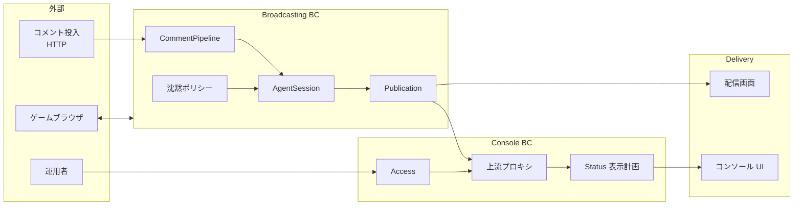
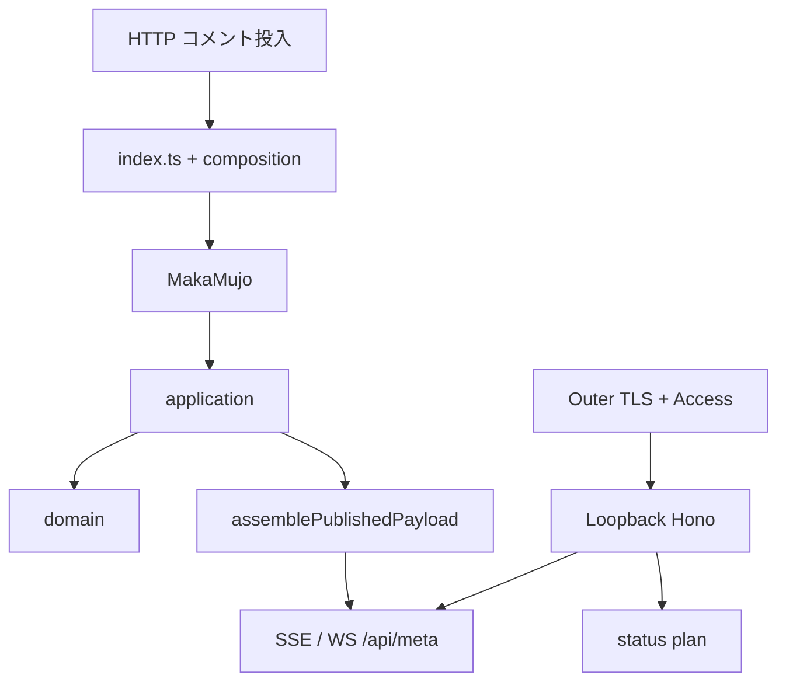

# アーキテクチャ概要

| 項目 | 内容 |
|------|------|
| **方式** | ミノ駆動（ユビキタス言語・境界づけられたコンテキストを先に固定） |
| **制約** | 振る舞い変更は観測可能な契約（ゴールデンテスト）を先に更新する |

詳細:

- Broadcasting BC → [domain-model-redesign.md](./domain-model-redesign.md)
- Console BC → [console-domain-model.md](./console-domain-model.md)

エンジニアリング文書は `architecture/` のみ。`docs/` はランディング静的資産専用。

---

## 1. プロダクト

**馬可無序（MAKA Mujo）** は、AI がゲームをプレイし、マルコフ連鎖によるトークとコメント反応を伴ってライブ配信する AI VTuber のアプリケーション層である。

| 目的 | 説明 |
|------|------|
| 自律プレイ | ゲームブラウザを IPC 経由で操作する |
| トーク | トークモデル生成 → TTS → 視聴者へ提示 |
| コメント反応 | 投入コメントの学習と返信トピック |
| 状態の公開 | 沈黙可否・メタ・履歴を画面とコンソールへ投影 |
| 運用 | 起動・停止・認証・再起動が可能であること |

変更容易性は「テストが緑」だけでなく、**境界をまたがずに意図を変えられるか**、**用語が実装と一致しているか** で測る。

---

## 2. コンテキスト地図



| コンテキスト | 責務 | 持たないもの |
|--------------|------|--------------|
| **Broadcasting** | コメント処理、沈黙、発話キュー、内部状態、公開ペイロードの組み立て | コンソールの IP/Basic、HTML レイアウト |
| **Console** | アクセス制御、表示計画、上流 SSE/HTTP の橋渡し | CommentPipeline や沈黙の規則そのもの |
| **Delivery** | 投影の描画 | ドメイン規則の発明 |
| **ゲームブラウザ** | 画面操作と State 供給（別プロセス） | トークモデル・沈黙 |

1. Console は Broadcasting の **公開投影だけ** を読む。`AgentSession` は共有しない。
2. コメント・沈黙・返信トピックは Broadcasting の用語で決める。
3. ゲーム IPC は `lib/Browser` / AGT 境界に閉じる。

---

## 3. ユビキタス言語

| 日本語 | 識別子の目安 | 定義 |
|--------|--------------|------|
| 番組 / 配信 | Program / Stream / Live | 生放送の継続単位 |
| コメント | Comment / AgentComment | 視聴者またはシステムの発話単位。外部から投入される |
| コメント投入 | Comment ingress | HTTP 等でプロセスへコメント列を渡すこと |
| CommentPipeline | CommentPipeline | 数え・学習・返信対象決定の一連の規則 |
| 沈黙 / 発話可能 | Silence / speechable / canSpeak | 今しゃべってよいか |
| 発話 | Speech | TTS に載せる生成結果 |
| 内部配信状態 | Agent internal stream state | エージェントが持つ live/offline と meta |
| 公開ペイロード | PublishedStreamPayload | SSE/WS/`/api/meta` が返す投影 |
| 返信先コメント | replyTargetComment | 発話が反応しているコメント |
| AgentSession | AgentSession | Broadcasting のランタイム状態の所有点 |
| 外側サーバ | Outer console | :443 TLS。production で IP + Basic |
| ループバックコンソール | Loopback console | 127.0.0.1 上のコンソール本体 |
| 表示計画 | Status plan | 公開ペイロードから見せる行を決める純関数結果 |

用語変更は識別子・テスト・UI と同時に揃える。

---

## 4. 状態所有

```text
commands                         project
Comment / onAir  →  AgentSession  →  PublishedStreamPayload
                    （書き込み）         （読みモデル）
                                            ↓
                                   配信画面 / コンソール表示計画
```

| 対象 | 所有者 |
|------|--------|
| コメント番号・最終コメント時刻・prompt フラグ等 | `AgentSession` |
| 沈黙判定の入力 | `AgentSession` + `SilencePolicy`（純関数） |
| 発話キュー | SpeechQueue + TTS ポート |
| 公開 JSON | Publication アセンブラが都度投影 |
| コンソールの行 | Console の plan（公開 JSON が入力） |
| Basic auth パスワード | 運用設定（env / ファイル）。ドメイン規則ではない |

内部 stream と公開 `niconama` 形は意図的に異なる。正規化は publication 境界に閉じる。

---

## 5. 配置

フォルダは BC を表現する手段であり、BC の定義そのものではない。

| 関心 | 置き場 | 制約 |
|------|--------|------|
| 純規則 | `lib/domain/**` | 副作用なし |
| Session 操作 | `lib/application/**` | I/O はポートで受ける |
| AgentLike 入口 | `lib/Agent` | ファサードを不用意に広げない |
| 配線 | `composition/**`, `index.ts` | ドメイン規則を書かない |
| コンソール host | `console/index.ts` | access を re-export しない |
| コンソール UI | `console/src/**` | `tests/` を import しない |
| 配信画面 | `src/**` | 公開投影の消費 |
| HTTP | `routes/**` | 薄いアダプタ |

Composition / host に CommentPipeline 分岐や沈黙の意味、表示行順の発明を書かない。

---

## 6. ランタイム



- **コメントの標準境界**: プロセス外からの HTTP 投入。
- プロセス内ニコ生 WebSocket / Playwright クライアントは必須にしない。入れるなら Comment ingress のアダプタとして切り、Broadcasting 用語に翻訳してから Session へ。

Console の運用契約（詳細は console 文書）:

| 項目 | 契約 |
|------|------|
| production | AllowedIP かつ Basic（user `admin`） |
| 秘密 | `CONSOLE_BASIC_AUTH_PASSWORD` 優先。なければ永続ファイル |
| 上流障害 | SSE 非 2xx を unhandled にしない |

---

## 7. ゴールデン

| 領域 | テスト |
|------|--------|
| CommentPipeline / speechable / 公開合成 | `lib/Agent/index.test.ts`、`lib/domain/**`、publication |
| Console access / plan / SSE | `lib/domain/console/*.test.ts` |
| Console host / proxy | `tests/integration/console/**`, `console-proxy*.ts` |
| ブラウザ起動解決 | `lib/Browser/*` |

規則やペイロードを変えるときは、該当 BC 文書とゴールデンを先に直す。

---

## 8. 非目標

| 非目標 | 理由 |
|--------|------|
| プロセス内ニコ生クライアント必須化 | ingress はアダプタに切り、Broadcasting を肥大化させない |
| コンソールが Session を直接共有 | 境界破壊 |
| God object への巻き戻し | 変更容易性の否定 |
| 沈黙閾値・プロンプトの暗黙変更 | 仕様変更でありリファクタの名で行わない |

---

## 9. 運用アダプタ

モデルの外側。手順の詳細は `etc/systemd/README.md`。

| 項目 | 内容 |
|------|------|
| 開発 | `bin/start` / `bin/stop` |
| 本番 | systemd + `make install`（`@PREFIX@` / `@BUN_BIN@` を置換） |
| Chromium | 既定 bundled。lock は Singleton* のみ |
| 確認順 | `typecheck` → `lint` → `test` → `test:integration` |

---

## 10. 変更手順

1. 言葉（ユビキタス言語）  
2. 境界（どの BC か）  
3. 所有（誰が書くか）  
4. 契約（ゴールデン）  
5. 配置（domain → application → host）  
6. 検証  

入口: [`AGENTS.md`](../AGENTS.md) → 本ファイル → 対象 BC 文書。

---

## 関連

- [domain-model-redesign.md](./domain-model-redesign.md)
- [console-domain-model.md](./console-domain-model.md)
- [`AGENTS.md`](../AGENTS.md)
- [`etc/systemd/README.md`](../etc/systemd/README.md)
