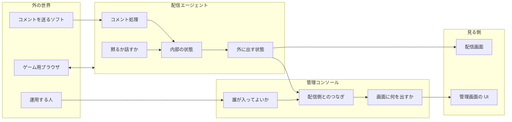
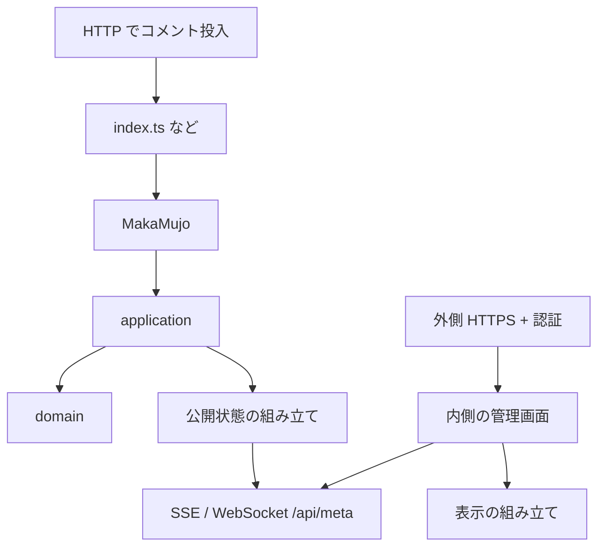

# アーキテクチャ概要

| 項目 | 内容 |
|------|------|
| **方針** | 用語の意味と、機能の境界を先に決めてから実装する |
| **制約** | 動きを変えるときは、先に基準テストを直す |

詳細な設計:

- 配信エージェント → [domain-model-redesign.md](./domain-model-redesign.md)
- 管理コンソール → [console-domain-model.md](./console-domain-model.md)

設計メモは `architecture/` に置く。`docs/` はサイト用の静的ファイル専用。

---

## 1. このプロダクトは何か

**馬可無序（MAKA Mujo）** は、AI がゲームを遊び、トークとコメント反応付きでライブ配信する AI VTuber 用のアプリである。

| やること | 内容 |
|----------|------|
| ゲームを遊ぶ | ブラウザを自動操作する |
| 話す | 文章を作って読み上げる |
| コメントに反応する | 外から来たコメントを学習し、話題にする |
| 状態を見せる | 配信中かどうか・履歴などを画面と管理画面に出す |
| 運用できる | 起動・停止・ログイン・再起動ができる |

コードを直すときの判断は、「テストが通るか」だけでなく、**別の機能の境界をまたいでいないか**、**同じ言葉が同じ意味で使われているか** を見る。

---

## 2. 機能の分かれ方

アプリを大きく次のまとまりに分ける。



| まとまり | やること | やらないこと |
|----------|----------|--------------|
| **配信エージェント** | コメント処理、黙る／話す、発話、内部状態、外に出すデータの組み立て | 管理画面のログインや HTML レイアウト |
| **管理コンソール** | 誰が入るか、何をどう並べて見せるか、配信側 API への中継 | コメント処理や「黙るか」の規則そのもの |
| **画面** | 受け取った状態の表示 | ビジネス規則の発明 |
| **ゲーム用ブラウザ** | 画面操作と状態の供給（別プロセス） | トークや沈黙の判断 |

約束:

1. 管理コンソールは、配信エージェントの **外向けのデータだけ** を見る。内部の生の状態オブジェクトは共有しない。
2. コメントの意味・黙るか・返信の相手は、配信エージェント側の言葉で決める。
3. ゲームとのやりとりはブラウザまわりのコードに閉じる。

---

## 3. 用語

| 日本語 | コード上の名前の目安 | 意味 |
|--------|----------------------|------|
| 番組 / 配信 | Program / Stream / Live | いまの生放送 |
| コメント | Comment | 視聴者やシステムの一言。外からアプリに入れる |
| コメント投入 | — | HTTP などでコメントの列をプロセスに渡すこと |
| コメント処理の流れ | CommentPipeline | 数え方・学習・返信相手の決め方 |
| 沈黙 / 発話可能 | silence / speechable / canSpeak | いま話してよいか |
| 発話 | Speech | 読み上げる文。履歴に残りうる |
| 内部の配信状態 | （エージェント内部） | エージェントが持つ live / 終了とメタ情報 |
| 公開する配信状態 | PublishedStreamPayload | 画面や API が返す形（`niconama` など） |
| 返信先コメント | replyTargetComment | いまの発話が反応しているコメント |
| 内部状態の置き場 | AgentSession | 配信エージェントが状態をまとめて持つ場所 |
| 外側サーバ | — | インターネット向け HTTPS（本番では IP 制限とパスワード） |
| 内側のコンソール | — | 127.0.0.1 だけで動く管理画面本体 |
| 表示の組み立て | Status plan | 公開データから「何をどの順で出すか」を決める処理 |

言葉の意味を変えるときは、コード名・テスト・画面文言も一緒に直す。

---

## 4. 状態は誰が持つか

```text
操作（コメント投入・onAir など）
        ↓ 書き込み
   内部状態（AgentSession）
        ↓ 組み立てて公開
   公開する配信状態（API / SSE / WebSocket）
        ↓
   配信画面・管理画面の表示
```

| もの | 誰が持つか |
|------|------------|
| コメント番号・最終コメント時刻など | 配信エージェントの内部状態 |
| 黙るかの判断材料 | 同上 + 純粋な判定関数 |
| 読み上げ待ち | 発話キューと音声出力 |
| API に載る JSON | その都度組み立てる（内部状態の丸写しではない） |
| 管理画面の各行 | 公開 JSON を入力にした表示用の組み立て |
| 管理画面パスワード | 設定（環境変数やファイル）。配信ロジックではない |

内部用の形と、外に出す形はわざと違う。変換は「公開用に組み立てる」処理に閉じる。

---

## 5. コードの置き場所

| 関心 | 置き場所 | 注意 |
|------|----------|------|
| 副作用のない規則 | `lib/domain/**` | ファイル I/O やネットをしない |
| 内部状態をいじる処理 | `lib/application/**` | 外とのやりとりは引数で渡す |
| 外から見たエージェント API | `lib/Agent` | 入口をむやみに増やさない |
| プロセスの配線 | `composition/**`, `index.ts` | ここに規則を書かない |
| 管理コンソールの起動・認証 | `console/index.ts` | ドメイン関数をここから再公開しない |
| 管理画面 UI | `console/src/**` | テスト専用フォルダを import しない |
| 配信画面 UI | `src/**` | 公開された状態を表示する |
| HTTP の入口 | `routes/**` | 薄く保つ |

`index.ts` や composition に、コメント処理の分岐や「黙るか」の意味、管理画面の行順の発明を書かない。

---

## 6. 動かし方の見取り図



### コメントの入れ方（本番）

`origin/main` の本番経路に合わせる。

| 経路 | 役割 |
|------|------|
| **本線** | プロセス内のニコ生コメントクライアント（`composition/niconamaCommentIngress.ts` → `lib/niconamaCommentClient`）。起動後に遅延 start。 |
| **副線** | HTTP `POST`/`PUT /` でコメント列を投入（ツール・テスト・外部ソフト用）。main では 404 だったが、こちらは残す。 |

- 無効化: `NICONAMA_DISABLE=1`（副線 HTTP のみ）
- 設定: `NICONAMA_WATCH_URL`、`NICONAMA_USER_DATA_DIR`、`CHROMIUM_EXECUTABLE_PATH`（任意）、`NICONAMA_START_MAX_RETRIES` など

管理コンソール（本番）:

| 項目 | 内容 |
|------|------|
| 入場 | 許可した IP と Basic 認証（ユーザー `admin`） |
| パスワード | 環境変数を優先。なければファイルに保存して再利用 |
| 上流が落ちたとき | エラーでプロセスを落とさない |

---

## 7. 壊してはいけないテスト

| 領域 | テストの場所 |
|------|----------------|
| コメント処理・発話可能・公開の組み立て | `lib/Agent/index.test.ts`、`lib/domain/**` など |
| コンソールの入場・表示・SSE の切り出し | `lib/domain/console/*.test.ts` |
| コンソール本体・中継 | `tests/integration/console/**` など |
| ブラウザの起動パス | `lib/Browser/*` |

規則や API の形を変えるときは、設計メモとこれらのテストを先に直す。

---

## 8. やらないこと

| やらないこと | 理由 |
|--------------|------|
| ニコ生クライアントを必須にする | コメント投入は外からで足りる。本体を膨らませない |
| 管理コンソールが内部状態を直接いじる | 境界が壊れる |
| 全部を一つの巨大クラスに戻す | 直しにくくなる |
| 黙る秒数や定型文を、リファクタのついでに変える | 仕様変更は別件 |

---

## 9. 起動・デプロイ（短い）

| 項目 | 内容 |
|------|------|
| 開発 | `bin/start` / `bin/stop` |
| 本番 | systemd と `make install`（パスは install 時に埋める） |
| ブラウザ | 原則 Playwright 同梱版。lock は Singleton* のみ。古い `playwright-*` 一時ディレクトリは起動時に削除し、セッション用はプロセス終了時に削除 |
| 確認の順 | `typecheck` → `lint` → `test` → `test:integration` |

手順の詳細は `etc/systemd/README.md`。

---

## 10. 変更の進め方

1. 用語は合っているか  
2. どのまとまり（配信 / コンソール）の話か  
3. 状態を書くのは誰か  
4. 基準テストを先に直すか足すか  
5. domain → application → 配線の順で厚くする  
6. 型チェックとテスト  

入口: [`AGENTS.md`](../AGENTS.md) → 本ファイル → 配信エージェントまたは管理コンソールの詳細設計。

---

## 関連

- [domain-model-redesign.md](./domain-model-redesign.md)
- [console-domain-model.md](./console-domain-model.md)
- [`AGENTS.md`](../AGENTS.md)
- [`etc/systemd/README.md`](../etc/systemd/README.md)
